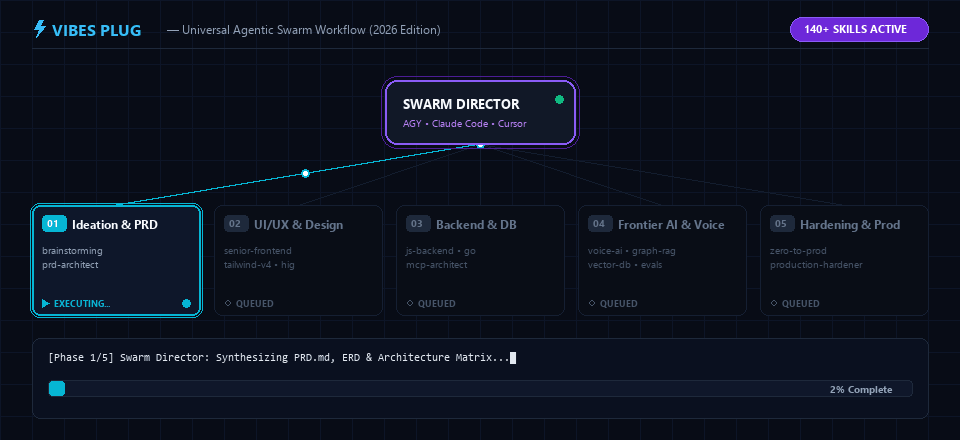
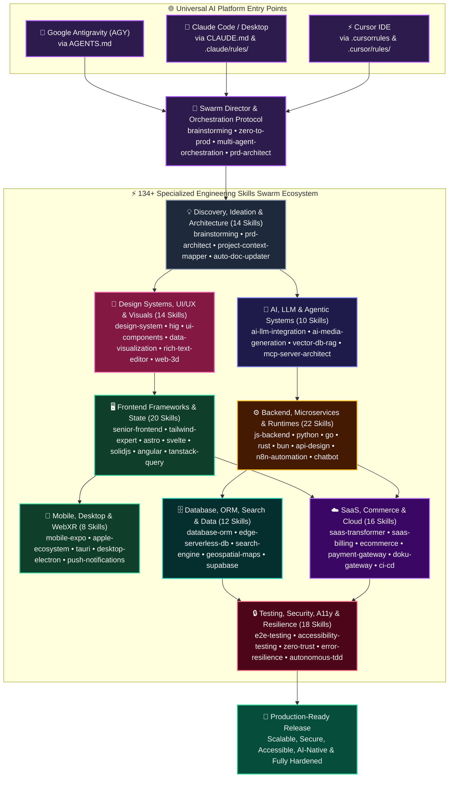

# Vibes Plug

[](https://github.com/roedyrustam/vibes-plug)
[](skills/)
[](https://github.com/roedyrustam/vibes-plug)
[](https://github.com/roedyrustam/vibes-plug)
[](https://github.com/roedyrustam/vibes-plug)
[](LICENSE)




### ⚡ Universal 134+ Skills Multi-Platform Agentic Swarm Architecture



[English](#english) | [Bahasa Indonesia](#bahasa-indonesia)

---

<a name="english"></a>
## English

**2026 Edition** — Universal AI plugin for **Antigravity**, **Claude**, and **Cursor** containing **134+ specialized _skills_** updated for the modern 2026 tech stack (React 19, Next.js 15, Tailwind v4, Bun 1.2+, Hono v4, Node.js 24 LTS, Python 3.14, TypeScript 5.8+). Designed to support software development, UI/UX design, AI/LLM integration, SEO optimization, and SaaS business strategies.

### Installation

#### 🟢 Antigravity (AGY)

Clone the Git repository directly into your Antigravity plugins directory.

**Windows (PowerShell / CMD):**
```bash
git clone https://github.com/roedyrustam/vibes-plug.git "$HOME\.gemini\config\plugins\vibes-plug"
```

**Mac / Linux (Terminal):**
```bash
git clone https://github.com/roedyrustam/vibes-plug.git ~/.gemini/config/plugins/vibes-plug
```

Antigravity will automatically scan the folder and detect all plugins and skills.

#### 🟠 Claude Code / Claude Desktop

Clone `vibes-plug` and run the installer to set up Claude-compatible config files.

```bash
# 1. Clone the repo
git clone https://github.com/roedyrustam/vibes-plug.git ~/vibes-plug

# 2. Run the Claude installer
node ~/vibes-plug/scripts/install.js --claude
```

This copies `CLAUDE.md`, `.claude/rules/`, and `skills/` to `~/.claude/`.

**Per-project install** (optional — for project-specific rules):
```bash
node ~/vibes-plug/scripts/install.js --claude --project ./my-project
```

#### 🔵 Cursor IDE

Cursor uses per-project configuration. Clone `vibes-plug` and install into your project:

```bash
# 1. Clone the repo
git clone https://github.com/roedyrustam/vibes-plug.git ~/vibes-plug

# 2. Run the Cursor installer
node ~/vibes-plug/scripts/install.js --cursor --project ./my-project
```

This copies `.cursorrules`, `.cursor/rules/`, and `skills/` to your project directory.

#### 🚀 Install for All Platforms

```bash
node ~/vibes-plug/scripts/install.js --all --project ./my-project
```

> **Tip:** To update skills in the future, run `git pull` from inside the `vibes-plug` folder, then re-run the installer.

**Using npm:**
```bash
npm install vibes-plug
```

**Using curl & tar:**
```bash
mkdir -p ~/.gemini/config/plugins/vibes-plug && curl -L https://registry.npmjs.org/vibes-plug/-/vibes-plug-1.0.0.tgz | tar -xz -C ~/.gemini/config/plugins/vibes-plug --strip-components=1
```

---

### Features and Available Skills

This plugin provides the following **134+ specialized skills** across 9 core engineering domains:

#### 🤖 AI & Agentic Systems
- **Ai Llm Integration Expert** (`ai-llm-integration-expert`): Expert guide for integrating Large Language Models (LLMs), Model Context Protocol (MCP), RAG architecture, vector databases, and AI agents.
- **Ai Prompt Engineering Expert** (`ai-prompt-engineering-expert`): Expert guide for systematic Prompt Engineering, Chain-of-Thought, few-shot prompting, structured output (JSON mode), prompt versioning, and LLM evaluation.
- **Ai Media Generation Expert** (`ai-media-generation-expert`): Expert guide for AI image generation (Flux, DALL-E, Stable Diffusion), video generation (Sora, Runway), voice synthesis (ElevenLabs TTS), and speech recognition (Whisper STT) integration.
- **Ai Cost Token Optimizer** (`ai-cost-token-optimizer`): Expert guide for LLM API cost optimization, Prompt Caching, model routing (Flash/Pro/Opus), semantic caching, and token budgeting.
- **Vector Db Rag Expert** (`vector-db-rag-expert`): Expert guide for high-performance Vector Databases, RAG architectures, pgvector HNSW indexing, hybrid search (Dense + BM25), and semantic chunking.
- **Mcp Server Architect** (`mcp-server-architect`): Ultimate guide for designing, building, and security-hardening modern AI Tools/Bots via Model Context Protocol (MCP) in TypeScript and Python.
- **Mcp Client Orchestrator** (`mcp-client-orchestrator`): Expert guide for the AI Agent to dynamically orchestrate and consume external MCP (Model Context Protocol) servers, giving it real-time superpowers over databases, GitHub, Slack, and local files.
- **Multi Agent Orchestration** (`multi-agent-orchestration`): Expert guide for designing and orchestrating multi-agent systems, agent swarms, graph-based workflows (LangGraph, CrewAI, AutoGen), shared state memory, and human-in-the-loop guardrails in English and Indonesian.
- **Gemini Agent Booster** (`gemini-agent-booster`): Master optimization protocol for Gemini Agent (Antigravity) to unlock native 1M+ long-context reasoning, multimodal vision UI audits, visual subagent feedback, and high-speed problem solving.
- **Proactive Background Watcher** (`proactive-background-watcher`): Grants the AI the ability to act proactively using native cron/timer scheduling. The agent can monitor systems, poll APIs, or watch logs in the background and self-trigger without waiting for user prompts.
- **Self Evolving Memory Graph** (`self-evolving-memory-graph`): Grants the AI long-term episodic memory. The agent autonomously documents the user's coding preferences, past mistakes to avoid, and architectural decisions into a persistent learning graph.
- **Doku Mcp Server** (`doku-mcp-server`): Expert guide for DOKU Model Context Protocol (MCP) Server integration. Enables AI Agentic Commerce with tools for payment links, Virtual Accounts, QRIS, transaction status checks, and client configuration (Claude Desktop, Cursor, AGY).

#### 🎨 Design & UI/UX
- **Design System Architect** (`design-system-architect`): Expert guide for designing, building, and maintaining scalable UI design systems with design tokens, headless primitives, Material Design 3 (M3), Tailwind v4 @theme, and WCAG 2.2 accessibility.
- **Hig** (`hig`): Applies Human Interface Guidelines (HIG) principles — Hierarchy, Harmony, and Consistency — to UI/UX designs to ensure intuitive and cohesive interfaces.
- **Monday Design Aesthetic** (`monday-design-aesthetic`): Expert guide for implementing the modern, spacious, and highly structured Monday.com design system.
- **Ui Components Expert** (`ui-components-expert`): Expert guide for building production-quality UI components following the 4 pillars. Covers React 19, Radix UI, Base UI, Tailwind v4, Material Design 3 (M3), WCAG 2.2.
- **Ui Ux Pro Max** (`ui-ux-pro-max`): Comprehensive design guide & BM25 search engine for web and mobile applications across 11 tech stacks.
- **Data Visualization Expert** (`data-visualization-expert`): Expert guide for data visualization, charts, and dashboards using D3.js, Recharts, Chart.js, Nivo, and Tremor.
- **Rich Text Editor Expert** (`rich-text-editor-expert`): Expert guide for rich text editor integration (Tiptap, Lexical, ProseMirror), collaborative editing, and custom extensions.
- **Svg Animation Motion Expert** (`svg-animation-motion-expert`): Expert guide for web animations: SVG manipulation, Framer Motion 12+, GSAP 3, CSS Scroll-Driven Animations, and View Transitions API.
- **Web 3d Graphics Expert** (`web-3d-graphics-expert`): Expert guide for WebGL and 3D graphics in the browser using Three.js, Babylon.js, React Three Fiber (R3F), and TresJS. Covers scene optimization, shaders, lighting, 3D model loading (GLTF/GLB), and performance tuning.
- **Glsl Shader Expert** (`glsl-shader-expert`): Expert guide for writing custom GLSL shaders (Vertex/Fragment) for WebGL using Three.js and Babylon.js. Covers shader materials, post-processing, noise, and performance optimization.
- **Webxr Ar Vr Expert** (`webxr-ar-vr-expert`): Expert guide for WebXR (Web-based Virtual and Augmented Reality) development using Babylon.js and Three.js. Covers device compatibility, immersive sessions, controllers, and hit-testing.
- **Visual Qa Vision Agent** (`visual-qa-vision-agent`): Equips the AI agent with visual QA capabilities using Playwright/Puppeteer and the agent's innate Vision capabilities to self-correct UI layout, CSS alignment, and visual regressions.

#### 🖥️ Frontend, Mobile & State
- **Senior Frontend** (`senior-frontend`): Frontend development for React 19, Next.js 15, TypeScript, and Tailwind CSS v4.
- **Nextjs App Router Expert** (`nextjs-app-router-expert`): Expert guide for Next.js 15 App Router: RSC, Server Actions, Middleware, Parallel/Intercepting Routes, Streaming, and Caching strategies.
- **Tailwind Expert** (`tailwind-expert`): Expert guide for Tailwind CSS v4, CSS-first configuration, @theme customization, and modern responsive design.
- **Astro Framework Expert** (`astro-framework-expert`): Expert guide for Astro 5+ framework — Content Collections, Islands Architecture, View Transitions, partial hydration, and MDX integration.
- **Svelte Sveltekit Expert** (`svelte-sveltekit-expert`): Expert guide for Svelte 5 (Runes) and SvelteKit 2+ — fine-grained reactivity, server-first architecture, form actions, and SSR/SSG.
- **Solidjs Expert** (`solidjs-expert`): Expert guide for SolidJS 2 and SolidStart — fine-grained reactivity, signals, createResource, and server-first rendering.
- **Angular Expert** (`angular-expert`): Expert guide for Angular 19+ enterprise applications — Signals, Standalone Components, NgRx SignalStore, SSR with Hydration, and Angular Material 3.
- **Vue Frontend Expert** (`vue-frontend-expert`): Expert guide for Vue 3 (Composition API), Nuxt 3, and Pinia. Covers advanced reactive state management, `<script setup>` syntax, Vue Router, VueUse, and SPA/SSR architectural patterns in English and Indonesian.
- **Form Validation Expert** (`form-validation-expert`): Expert guide for complex form handling with React Hook Form, server-side validation (useActionState + Zod), multi-step wizards, and accessible form patterns.
- **State Management Expert** (`state-management-expert`): Expert guide for modern client-side state management: Zustand, Jotai, Valtio, TanStack Store, Redux Toolkit, and server state patterns with TanStack Query.
- **Tanstack Query Expert** (`tanstack-query-expert`): Advanced TanStack Query (v5) expert. Covers useSuspenseQuery, infinite scrolling, optimistic mutations, SSR/React Server Components hydration, and advanced cache invalidation.
- **Spa Orchestrator** (`spa-orchestrator`): Orchestrates Single-Page Application (SPA) architecture, integrating frontend state management with API-driven backends.
- **Mpa Orchestrator** (`mpa-orchestrator`): Orchestrates Multi-Page Application (MPA) architecture within a single repository, integrating with relevant skills.
- **Bootstrap To Modern** (`bootstrap-to-modern`): Expert skill to refactor and migrate legacy Bootstrap CSS applications to modern stacks using Tailwind CSS v4 and Alpine.js.
- **Performance Web Vitals** (`performance-web-vitals`): Expert guide for Web Performance optimization: Core Web Vitals (LCP, INP, CLS), bundle analysis, image optimization, rendering strategies, and Lighthouse score improvement.
- **Realtime Collaboration Expert** (`realtime-collaboration-expert`): Expert guide for building real-time collaboration features using WebSockets, WebRTC, CRDTs (Yjs, Automerge), and Liveblocks.
- **Mobile Expo Expert** (`mobile-expo-expert`): Expert guide for React Native 0.79+ and Expo SDK 53+ development. Covers cross-platform mobile architecture, Expo Router v4, New Architecture, OTA updates, and native modules.
- **Apple Ecosystem Expert** (`apple-ecosystem-expert`): Expert guide for Apple Ecosystem development. Covers iOS support, Safari WebKit compatibility, PWAs (Progressive Web Apps) for iOS, and Human Interface Guidelines (HIG) for web and native apps.
- **Desktop Electron Expert** (`desktop-electron-expert`): Expert guide for Electron 33+ desktop application development — Electron Forge, context isolation, IPC security, native menus, auto-updates, and multi-window management.
- **Tauri Expert** (`tauri-expert`): Expert skill for Tauri (v2) development, Rust backend, IPC, and security.
- **Mobile Push Notification Expert** (`mobile-push-notification-expert`): Expert guide for Cross-Platform Push Notifications (Expo Push, FCM, APNs, Web Push), iOS Live Activities, and background payload handling.
- **Web Game Engine Expert** (`web-game-engine-expert`): Expert guide for web-based game development. Covers Entity Component System (ECS) architectures, physics engines (Rapier, Havok, Cannon-es), collision detection, and game loop optimization.
- **Blockchain Web3 Expert** (`blockchain-web3-expert`): Expert guide for Web3 and blockchain dApp integration — viem, wagmi v2, ethers.js v6, RainbowKit, smart contract interactions, and EVM wallet state.
- **Multiple Entry Points** (`multiple-entry-points`): Expert guide for designing and implementing Multiple Entry Points architecture in web applications.
- **Micro Frontend Architect** (`micro-frontend-architect`): Expert guide for designing Micro-Frontend architectures using Webpack Module Federation, Vite Federation, and Single-SPA for large scale Vue and React applications.
- **Project Context Mapper** (`project-context-mapper`): Gives the agent a photographic memory of massive repositories. Forces the creation and maintenance of a highly compressed CONTEXT_MAP.md to prevent context exhaustion and hallucination.

#### ⚙️ Backend, Languages & Runtimes
- **Js Backend Expert** (`js-backend-expert`): Expert-level skill for Node.js 24+ (LTS), Bun 1.2+, and Deno 2.x backend development. Covers Express 5, Fastify 5, Hono v4, NestJS, Prisma 6, Drizzle ORM, WebSockets, BullMQ, OpenTelemetry, and microservices in English and Indonesian.
- **Bun Runtime Expert** (`bun-runtime-expert`): Expert guide for Bun JavaScript/TypeScript runtime. Use when building, testing, or deploying applications with Bun.
- **Python Programming Expert** (`python-programming-expert`): Expert-level skill for Python programming (Python 3.13/3.14+). Covers type safety, generic syntax (PEP 695), async/await TaskGroups, FastAPI 0.115+, Pydantic v2, uv package manager, Ruff, and pytest in English and Indonesian.
- **Go Programming Expert** (`go-programming-expert`): Expert-level skill for Go programming (Go 1.25+). Covers high-performance microservices, concurrency patterns, sqlc, net/http, Gin/Echo/Fiber, gRPC, and testing in English and Indonesian.
- **Rust Programming Expert** (`rust-programming-expert`): Expert-level skill for Rust programming (Rust 2024.
- **Typescript Expert** (`typescript-expert`): Expert guide for TypeScript 5.8+ advanced type system, strict mode, generics, utility types, branded types, inferred type predicates, isolated declarations, and type-safe architectural patterns.
- **Mvc Expert** (`mvc-expert`): Expert guidelines to refactor legacy PHP codebases into clean, modern, and scalable MVC-structured projects.
- **Domain Driven Design Expert** (`domain-driven-design-expert`): Expert guide for Domain-Driven Design (DDD). Covers tactical patterns (Aggregates, Value Objects), strategic patterns (Bounded Contexts), event storming, and CQRS.
- **Api Design Expert** (`api-design-expert`): Expert guide for designing robust APIs: REST best practices, GraphQL, gRPC, tRPC, OpenAPI/Swagger, API versioning, rate limiting, and contract-first design.
- **Api Gateway Proxy Expert** (`api-gateway-proxy-expert`): Expert guide for API Gateways, Reverse Proxies, and Service Mesh. Covers Kong, Traefik, NGINX, Cloudflare Gateway, and load balancing.
- **Graphql Apollo Expert** (`graphql-apollo-expert`): Expert guide for designing and consuming GraphQL APIs. Covers Apollo Server/Client, NestJS GraphQL (Code-First & Schema-First), TypeGraphQL, caching, and N+1 query optimization.
- **Openapi Swagger Codegen Expert** (`openapi-swagger-codegen-expert`): OpenAPI 3.1 spec authoring, Swagger UI, automatic client/server code generation (openapi-typescript, Orval, Kiota), contract testing.
- **Async Queue Temporal Expert** (`async-queue-temporal-expert`): Expert guide for Durable Workflow Engines (Temporal.io, Trigger.dev v3, Inngest, BullMQ v5) and fault-tolerant background sagas.
- **Background Jobs Queue Expert** (`background-jobs-queue-expert`): Dedicated deep-dive for BullMQ v5, Trigger.dev v3, Inngest, delayed jobs, job deduplication, idempotency, dead letter queues, and job priority.
- **Cron Scheduler Expert** (`cron-scheduler-expert`): Expert guide for scheduled tasks, cron jobs, recurring background work (Vercel Cron, Cloudflare Workers Cron, Inngest, node-cron), and distributed scheduling.
- **Sse Websocket Streaming Expert** (`sse-websocket-streaming-expert`): Expert guide for Server-Sent Events (SSE), WebSockets, and Streaming Architectures. Covers real-time data push, Socket.IO, Hono WebSocket, and AI response streaming.
- **N8n Automation Expert** (`n8n-automation-expert`): Expert guide for workflow automation (n8n, Zapier, Make), custom nodes, webhook triggers, and AI-powered automation chains.
- **Chatbot Messaging Expert** (`chatbot-messaging-expert`): Expert guide for chatbot and messaging platform integration (WhatsApp Business, Telegram Bot, Discord.js, Slack Bolt) and conversational AI.
- **Pdf Document Generation Expert** (`pdf-document-generation-expert`): Expert guide for PDF generation and document processing (React PDF, Puppeteer, jsPDF, pdf-lib).
- **Wasm Edge Computing Expert** (`wasm-edge-computing-expert`): Expert guide for WebAssembly (WASM) and Edge Computing. Covers WASI preview 2, Spin/Fermyon, Cloudflare Workers WASM, and high-performance browser computing.
- **Autonomous Tdd Debugger** (`autonomous-tdd-debugger`): Empowers the agent to autonomously run tests, read terminal stack traces, and self-heal code until tests pass. Transforms the agent from a passive coder to an active CI pipeline debugger.

#### ☁️ SaaS Architecture, Systems & Cloud
- **Saas Mvp Launcher** (`saas-mvp-launcher`): Structured roadmap and design to plan and launch a SaaS MVP from scratch.
- **Saas Transformer** (`saas-transformer`): Transforms regular applications into complete SaaS platforms with multi-tenancy, billing, team management, and feature gating — orchestrating all relevant vibes-plug skills.
- **Saas Multi Tenant** (`saas-multi-tenant`): Design and implement multi-tenant SaaS architectures with RLS, tenant isolation, and PostgreSQL.
- **Saas Billing** (`saas-billing`): Implement and audit SaaS billing systems, subscription state machines, secure webhooks, and local database synchronization.
- **Feature Flag Analytics Expert** (`feature-flag-analytics-expert`): Expert guide for Feature Flags & Progressive Rollout (PostHog, LaunchDarkly, GrowthBook), A/B testing orchestration, and canary releases.
- **Payment Gateway Expert** (`payment-gateway-expert`): Expert guide for integrating payment gateways (Stripe, PayPal, Xendit, Midtrans, DOKU) and secure webhooks into SaaS platforms.
- **Doku Payment Gateway** (`doku-payment-gateway`): Expert guide for integrating DOKU Payment Gateway (Jokul API v2). Covers HMAC-SHA256 header signature calculation, Checkout & Direct APIs (VA, QRIS, E-Wallet, Credit Card), webhook notification verification, and sandbox/production setup.
- **Ecommerce Expert** (`ecommerce-expert`): Expert guide for e-commerce architecture (Shopify Storefront, Medusa.js, Saleor), product catalogs, cart/checkout UX, and order management.
- **Headless Cms Expert** (`headless-cms-expert`): Expert guide for Headless CMS integration (Sanity, Payload CMS, Strapi, Contentful, Storyblok) with modern frameworks.
- **Wordpress Headless Expert** (`wordpress-headless-expert`): Expert guide for headless WordPress architecture — WPGraphQL, ACF Pro, Faust.js, Next.js/Astro frontend, webhooks, and caching.
- **Email Notification Expert** (`email-notification-expert`): Expert guide for transactional email (Resend, Postmark, SES), React Email templates, in-app notifications, and unified communication pipelines.
- **File Upload Media Expert** (`file-upload-media-expert`): Expert guide for file uploads (S3, R2, Supabase Storage), presigned URLs, image/video processing, CDN optimization, and media pipeline architecture.
- **Fullstack Expert** (`fullstack-expert`): Expert-level fullstack development guide covering multi-language (TypeScript, Python, Go, Rust), multi-framework (Next.js, FastAPI, Gin, Axum), API design, microservices, DevOps, and system design.
- **Monorepo Architect** (`monorepo-architect`): Expert guide for designing and managing scalable monorepos using Turborepo, pnpm workspaces, and shared packages.
- **Event Driven Architect** (`event-driven-architect`): Expert guide for microservices, message queues, Event Sourcing, and high-scale backend architectures.
- **Legacy Code Translator** (`legacy-code-translator`): Methodological guide for the AI Agent to safely and systematically translate, refactor, and modernize giant legacy codebases (PHP, Python 2, old React) into modern stacks.
- **Cloud Hosting Expert** (`cloud-hosting-expert`): Expert guide for deploying SaaS applications with multiple entry points on modern edge and serverless platforms like Vercel and Cloudflare.
- **Ci Cd Devops Architect** (`ci-cd-devops-architect`): Expert guide for continuous integration, deployment pipelines, Docker, Kubernetes, and Infrastructure as Code (IaC).
- **Self Healing Cloud Orchestrator** (`self-healing-cloud-orchestrator`): Real-time log monitoring, crash detection, and auto-hotfixing code without human intervention.
- **Dependency Upgrade Migrator** (`dependency-upgrade-migrator`): Expert guide for dependency upgrades, breaking change migrations, codemod automation, and package audit remediation.
- **Prd Architect** (`prd-architect`): Mandatory guardrail skill that enforces creating a comprehensive Product Requirements Document (PRD), ERD, and Documentation before generating code for new projects.

#### 🗄️ Database & ORM
- **Database Orm Expert** (`database-orm-expert`): Expert guide for database schema design, ORM tools (Prisma 6, Drizzle ORM, TypeORM), migrations, query optimization, and type-safe SQL patterns in TypeScript.
- **Database Migration Versioning Expert** (`database-migration-versioning-expert`): Expert guide for database migrations: schema versioning, zero-downtime migrations, backward-compatible changes, data backfill, and rollback strategies.
- **Edge Serverless Db Expert** (`edge-serverless-db-expert`): Expert guide for Serverless & Edge Databases (Neon Serverless Postgres, Cloudflare D1, Turso/libsql, Upstash Redis), cold-start mitigation, and connection pooling.
- **Supabase Migration** (`supabase-migration`): A skill to create or apply a Supabase database migration.
- **Search Engine Expert** (`search-engine-expert`): Expert guide for full-text search engines (Typesense, Meilisearch, Elasticsearch), faceted search, and autocomplete.
- **Geospatial Maps Expert** (`geospatial-maps-expert`): Expert guide for maps and geospatial data (Mapbox GL JS, Leaflet, Google Maps, PostGIS).
- **Data Pipeline Etl Expert** (`data-pipeline-etl-expert`): Expert guide for Data Pipelines, ETL/ELT, and Analytics Engineering. Covers dbt, Apache Airflow, Dagster, BigQuery, ClickHouse, and DuckDB.

#### 🔒 Quality, Testing & Security
- **E2e Testing Expert** (`e2e-testing-expert`): Expert guide for End-to-End (E2E) testing with Playwright, unit/integration testing with Vitest, and CI/CD automated testing pipeline setup.
- **Accessibility Testing Expert** (`accessibility-testing-expert`): Expert guide for automated and manual Web Accessibility (a11y) testing — axe-core, Pa11y, Playwright a11y, screen reader testing, and WCAG 2.2 Level AA/AAA compliance.
- **Browser Automation Expert** (`browser-automation-expert`): Expert guide for autonomous web agents (Browser-Use, Stagehand), hardcore anti-bot evasion (Playwright Stealth, WebGL masking), and Vision LLM visual QA.
- **Authentication Identity Expert** (`authentication-identity-expert`): Expert guide for implementing secure authentication, authorization (RBAC/ABAC), OAuth2, and identity management (Clerk, Auth.js, Supabase Auth).
- **Rate Limit Abuse Prevention** (`rate-limit-abuse-prevention`): Expert guide for API rate limiting, bot protection, DDoS mitigation, brute-force prevention, and abuse detection.
- **Secure Fuzz Testing** (`secure-fuzz-testing`): Expert-level skill for writing and integrating coverage-guided fuzz tests in Python, Rust, and Go for secure code validation in English and Indonesian.
- **Autonomous Red Teamer** (`autonomous-red-teamer`): AI-driven dynamic security fuzzing, exploit generation (XSS, SQLi, SSRF, Prompt Injection), and automated patch remediation.
- **Autonomous Chaos Monkey** (`autonomous-chaos-monkey`): AI-driven Chaos Engineering. Randomly injects latency, terminates mock services, and automatically implements circuit breakers.
- **Error Resilience Expert** (`error-resilience-expert`): Expert guide for error handling patterns, resilience engineering, retry strategies, circuit breakers, and graceful degradation across React, Next.js, and Node.js.
- **Logging Error Tracking Expert** (`logging-error-tracking-expert`): Expert guide for structured logging (Pino, Winston), error tracking (Sentry), log aggregation (Axiom, Datadog), request correlation, and GDPR-compliant log management.
- **Post Quantum Crypto Migrator** (`post-quantum-crypto-migrator`): FinTech future-proofing. Scans and migrates classical encryption to NIST-approved Post-Quantum Cryptography (PQC).
- **Compliance Gdpr Privacy Expert** (`compliance-gdpr-privacy-expert`): Expert guide for Data Privacy, GDPR, CCPA, and PDPA compliance. Covers consent management, data retention, privacy-by-design, and audit trails.
- **Global A11y I18n Expert** (`global-a11y-i18n-expert`): Expert guide for Web Accessibility (WCAG a11y) and Internationalization (i18n).
- **Zero Trust Secret Vault** (`zero-trust-secret-vault`): Expert guide for Zero-Trust Secret Management (Infisical, HashiCorp Vault, Doppler), automated API key rotation, and environment security.
- **Firebase Security Expert** (`firebase-security-expert`): Firebase security expert to audit Security Rules (Firestore/Realtime Database/Storage), authentication, API keys, data leakage prevention, and App Check configuration.
- **Supabase Security Expert** (`supabase-security-expert`): Supabase security expert to audit RLS (Row Level Security), RBAC, relational databases, prevent data leakage, and utilize Supabase Linter.
- **Scalability Clean Code** (`scalability-clean-code`): Software architecture guidelines to maintain code readability (Clean Code, SOLID, DRY) and application scalability.
- **Biome Linter Formatter Expert** (`biome-linter-formatter-expert`): Expert guide for Biome (Rust-based linter + formatter), ESLint/Prettier migration, and code quality tooling.
- **Production Ready Hardener** (`production-ready-hardener`): Ultimate production readiness skill that orchestrates all relevant skills (frontend, backend, security, performance, SEO, testing, DevOps) to harden applications before deployment.
- **Zero To Prod Orchestrator** (`zero-to-prod-orchestrator`): Master orchestrator to build an application from scratch to a production-ready release, enforcing strict step-by-step progression and continuous documentation.

#### 🔍 SEO & Search Optimization
- **Seo** (`seo`): Run a broad SEO audit across technical SEO, on-page SEO, schema, sitemaps, content quality, AI search readiness, and GEO.

#### 🛠️ Utilities & Tools
- **Brainstorming** (`brainstorming`): Master ideation protocol & architectural orchestrator with Modern Web Guidance. Validates design ideas and orchestrates all specialized vibes-plug skills before coding begins.
- **Auto Doc Updater** (`auto-doc-updater`): Automatically documents every feature change or bug fix successfully built into CHANGELOG.md and BLUEPRINT.md.
- **Session Context Loader** (`session-context-loader`): Automatically loads and learns project context (Tech Stack, PRD, Roadmap, Blueprint) at the start of every new conversation session to ensure focused and directed development.
- **Session Handoff Resume** (`session-handoff-resume`): Skill to save ultra-compact project checkpoints and seamlessly resume work across accounts or new chat sessions with minimum token consumption.
- **Token Saver** (`token-saver`): Skill to implement token saving scheme, concise, and focused on essential changes.
- **App Analyzer Optimizer** (`app-analyzer-optimizer`): Deeply analyzes application architecture and structure to perform audit, bottleneck detection, and code/performance optimization.
- **Data Telemetry Expert** (`data-telemetry-expert`): Expert guide for observability, analytics, telemetry, and data pipelines (OpenTelemetry, PostHog, Mixpanel).
- **Coderabbit** (`coderabbit`): AI-powered automated code review, PR summarization, and interactive developer feedback.
- **Vibe Code Gardener** (`vibe-code-gardener`): Purger of AI slop, code bloat, context drift, and architectural decay in vibe-coded projects.
- **Web Scraper** (`web-scraper`): Smart agentic web data extraction with multi-strategy scraping (Crawl4AI v4, Firecrawl), LLM extraction loops, anti-bot bypass, and structured export.
- **Website Design Cloner** (`website-design-cloner`): Analyzes and reverse-engineers website designs directly from a target URL, extracting layout structures, design tokens (colors, typography, spacing), component hierarchies, visual assets, and responsive behaviors to enable full 1:1 duplication into modern code (Tailwind CSS v4, React/Next.js, HTML/CSS).
- **Documentation Site Expert** (`documentation-site-expert`): Expert guide for technical documentation sites (Mintlify, Docusaurus, Storybook, VitePress) and component documentation.
- **Asisten Ramah** (`asisten-ramah`): Skill to make Antigravity respond in a friendly manner.
- **Skill Baru** (`skill-baru`): Comprehensive template for creating new vibes-plug skills with proper structure, trigger conditions, and bilingual support.

---

### Universal Orchestration Workflow (The Power of Vibes Plug)

To unlock the full potential of `vibes-plug`, skills are designed to act as a **highly orchestrated, interconnected swarm** that builds upon each other:

1. **Ideation & Planning:** Start with `brainstorming` and `prd-architect` to validate requirements, architectures, and design ideas. Trigger `gemini-agent-booster` for deep architectural reasoning.
2. **Design & Frontend:** Trigger `design-system-architect` and `ui-ux-pro-max` to establish tokens, then use `senior-frontend` alongside `ui-components-expert`, `project-context-mapper`, and `tanstack-query-expert` to build robust, accessible UIs.
3. **Backend & Architecture:** Orchestrate `js-backend-expert` (or `go-programming-expert` / `rust-programming-expert`) with `event-driven-architect` and `autonomous-tdd-debugger` for high-performance, scalable backends. Add `authentication-identity-expert` for secure auth flows.
4. **AI Integration:** Invoke `ai-llm-integration-expert` and `mcp-server-architect` for LLM integrations and MCP tooling. Use `multi-agent-orchestration` and `mcp-client-orchestrator` for complex agentic workflows.
5. **SaaS Transformation:** Invoke `saas-transformer` or `saas-mvp-launcher` — these master skills automatically coordinate `saas-multi-tenant`, `saas-billing`, `payment-gateway-expert`, and `supabase-security-expert`.
6. **Quality & Launch:** Use `e2e-testing-expert`, `vibe-code-gardener`, and `seo` to validate. Finally, invoke `production-ready-hardener` to audit the entire system before Edge/Cloud deployment.

By letting skills naturally invoke one another, you transform the AI into a complete, end-to-end engineering team.

---

### Contributing

For those who want to contribute by adding new skills or updating existing ones, please read our complete guide at [CONTRIBUTING.md](CONTRIBUTING.md).

### Platform Compatibility

| Platform | Entry Point | Config Files | Skills Access |
|----------|-------------|--------------|---------------|
| **Antigravity (AGY)** | `AGENTS.md` | `plugin.json` | Direct via `skills/` |
| **Claude Code** | `CLAUDE.md` | `.claude/rules/*.md` | Via `skills/` directory |
| **Cursor IDE** | `.cursorrules` | `.cursor/rules/*.mdc` | Via `skills/` directory |

### Version
v2.7.1 (2026 Edition) — 134+ skills | Supports AGY + Claude + Cursor

### Repository
[https://github.com/roedyrustam/vibes-plug.git](https://github.com/roedyrustam/vibes-plug.git)

---

<a name="bahasa-indonesia"></a>
## Bahasa Indonesia


**Edisi 2026** — Plugin AI universal untuk **Antigravity**, **Claude**, dan **Cursor** yang berisi **134+ _skills_ khusus** yang diperbarui untuk tech stack modern 2026 (React 19, Next.js 15, Tailwind v4, Bun 1.2+, Hono v4, Node.js 24 LTS, Python 3.14, TypeScript 5.8+). Dirancang untuk menunjang pengembangan perangkat lunak, desain UI/UX, integrasi AI/LLM, optimasi SEO, hingga strategi bisnis SaaS.

### Instalasi

#### 🟢 Antigravity (AGY)

Clone repositori Git ke dalam direktori plugin Antigravity.

**Windows (PowerShell / CMD):**
```bash
git clone https://github.com/roedyrustam/vibes-plug.git "$HOME\.gemini\config\plugins\vibes-plug"
```

**Mac / Linux (Terminal):**
```bash
git clone https://github.com/roedyrustam/vibes-plug.git ~/.gemini/config/plugins/vibes-plug
```

Antigravity akan otomatis memindai folder dan mendeteksi seluruh plugin beserta *skills*.

#### 🟠 Claude Code / Claude Desktop

Clone `vibes-plug` dan jalankan installer untuk mengkonfigurasi Claude.

```bash
# 1. Clone repo
git clone https://github.com/roedyrustam/vibes-plug.git ~/vibes-plug

# 2. Jalankan installer Claude
node ~/vibes-plug/scripts/install.js --claude
```

Ini akan menyalin `CLAUDE.md`, `.claude/rules/`, dan `skills/` ke `~/.claude/`.

**Instalasi per-project** (opsional):
```bash
node ~/vibes-plug/scripts/install.js --claude --project ./proyek-saya
```

#### 🔵 Cursor IDE

Cursor menggunakan konfigurasi per-project. Clone `vibes-plug` lalu install ke proyek Anda:

```bash
# 1. Clone repo
git clone https://github.com/roedyrustam/vibes-plug.git ~/vibes-plug

# 2. Jalankan installer Cursor
node ~/vibes-plug/scripts/install.js --cursor --project ./proyek-saya
```

Ini akan menyalin `.cursorrules`, `.cursor/rules/`, dan `skills/` ke direktori proyek Anda.

#### 🚀 Install untuk Semua Platform

```bash
node ~/vibes-plug/scripts/install.js --all --project ./proyek-saya
```

> **Tip:** Untuk memperbarui skill, cukup jalankan `git pull` dari folder `vibes-plug`, lalu jalankan installer ulang.

**Menggunakan npm:**
```bash
npm install vibes-plug
```

**Menggunakan curl & tar:**
```bash
mkdir -p ~/.gemini/config/plugins/vibes-plug && curl -L https://registry.npmjs.org/vibes-plug/-/vibes-plug-1.0.0.tgz | tar -xz -C ~/.gemini/config/plugins/vibes-plug --strip-components=1
```

---

### Fitur dan Skills yang Tersedia

Plugin ini menyediakan **134+ kemampuan (*skills*) terspesialisasi** di 9 domain rekayasa utama:

#### 🤖 AI & Sistem Agen
- **Ai Llm Integration Expert** (`ai-llm-integration-expert`): Panduan ahli untuk integrasi LLM, Model Context Protocol (MCP), arsitektur RAG, vector database, dan agen AI.
- **Ai Prompt Engineering Expert** (`ai-prompt-engineering-expert`): Panduan ahli rekayasa prompt dan evaluasi LLM.
- **Ai Media Generation Expert** (`ai-media-generation-expert`): Panduan ahli integrasi AI generasi gambar, video, suara (TTS), dan pengenalan suara (STT).
- **Ai Cost Token Optimizer** (`ai-cost-token-optimizer`): Panduan ahli optimasi biaya API LLM, Prompt Caching, model routing, dan semantic caching.
- **Vector Db Rag Expert** (`vector-db-rag-expert`): Panduan ahli Vector DB, arsitektur RAG, pgvector HNSW, dan hybrid search.
- **Mcp Server Architect** (`mcp-server-architect`): Panduan utama merancang, membangun, dan mengamankan AI Tools/Bots modern melalui Model Context Protocol (MCP) dalam TypeScript dan Python.
- **Mcp Client Orchestrator** (`mcp-client-orchestrator`): Expert guide for the AI Agent to dynamically orchestrate and consume external MCP (Model Context Protocol) servers, giving it real-time superpowers over databases, GitHub, Slack, and local files.
- **Multi Agent Orchestration** (`multi-agent-orchestration`): Expert guide for designing and orchestrating multi-agent systems, agent swarms, graph-based workflows (LangGraph, CrewAI, AutoGen), shared state memory, and human-in-the-loop guardrails in English and Indonesian.
- **Gemini Agent Booster** (`gemini-agent-booster`): Protokol optimasi utama untuk Gemini Agent (Antigravity) untuk mengaktifkan pemikiran long-context 1M+, audit UI visual multimodal, dan pemecahan masalah kecepatan tinggi.
- **Proactive Background Watcher** (`proactive-background-watcher`): Grants the AI the ability to act proactively using native cron/timer scheduling. The agent can monitor systems, poll APIs, or watch logs in the background and self-trigger without waiting for user prompts.
- **Self Evolving Memory Graph** (`self-evolving-memory-graph`): Grants the AI long-term episodic memory. The agent autonomously documents the user's coding preferences, past mistakes to avoid, and architectural decisions into a persistent learning graph.
- **Doku Mcp Server** (`doku-mcp-server`): Panduan ahli DOKU MCP Server untuk AI Agentic Commerce.

#### 🎨 Desain & UI/UX
- **Design System Architect** (`design-system-architect`): Expert guide for designing, building, and maintaining scalable UI design systems with design tokens, headless primitives, Material Design 3 (M3), Tailwind v4 @theme, and WCAG 2.2 accessibility.
- **Hig** (`hig`): Menerapkan prinsip Human Interface Guidelines (HIG) — Hierarchy, Harmony, dan Consistency — pada desain UI/UX untuk memastikan antarmuka yang intuitif dan kohesif.
- **Monday Design Aesthetic** (`monday-design-aesthetic`): Panduan desain ala Monday.com.
- **Ui Components Expert** (`ui-components-expert`): Panduan ahli membangun komponen UI berkualitas produksi dengan M3.
- **Ui Ux Pro Max** (`ui-ux-pro-max`): Panduan desain komprehensif & mesin pencari BM25 untuk aplikasi web dan mobile di 11 tech stack.
- **Data Visualization Expert** (`data-visualization-expert`): Panduan ahli visualisasi data, chart, dan dashboard menggunakan D3.js, Recharts, Chart.js, Nivo, dan Tremor.
- **Rich Text Editor Expert** (`rich-text-editor-expert`): Panduan ahli integrasi editor rich text (Tiptap, Lexical, ProseMirror), editing kolaboratif, dan ekstensi kustom.
- **Svg Animation Motion Expert** (`svg-animation-motion-expert`): Panduan ahli animasi web.
- **Web 3d Graphics Expert** (`web-3d-graphics-expert`): Expert guide for WebGL and 3D graphics in the browser using Three.js, Babylon.js, React Three Fiber (R3F), and TresJS. Covers scene optimization, shaders, lighting, 3D model loading (GLTF/GLB), and performance tuning.
- **Glsl Shader Expert** (`glsl-shader-expert`): Expert guide for writing custom GLSL shaders (Vertex/Fragment) for WebGL using Three.js and Babylon.js. Covers shader materials, post-processing, noise, and performance optimization.
- **Webxr Ar Vr Expert** (`webxr-ar-vr-expert`): Expert guide for WebXR (Web-based Virtual and Augmented Reality) development using Babylon.js and Three.js. Covers device compatibility, immersive sessions, controllers, and hit-testing.
- **Visual Qa Vision Agent** (`visual-qa-vision-agent`): Equips the AI agent with visual QA capabilities using Playwright/Puppeteer and the agent's innate Vision capabilities to self-correct UI layout, CSS alignment, and visual regressions.

#### 🖥️ Frontend, Mobile & State
- **Senior Frontend** (`senior-frontend`): Pengembangan frontend dengan React 19, Next.js 15, TypeScript, dan Tailwind CSS v4.
- **Nextjs App Router Expert** (`nextjs-app-router-expert`): Panduan ahli untuk Next.js 15 App Router.
- **Tailwind Expert** (`tailwind-expert`): Panduan ahli untuk Tailwind CSS v4, konfigurasi CSS-first, kustomisasi @theme, dan desain responsif modern.
- **Astro Framework Expert** (`astro-framework-expert`): Panduan ahli framework Astro 5+ — Content Collections, Islands Architecture, View Transitions, partial hydration, dan integrasi MDX.
- **Svelte Sveltekit Expert** (`svelte-sveltekit-expert`): Panduan ahli Svelte 5 (Runes) dan SvelteKit 2+ — reaktivitas fine-grained, arsitektur server-first, form actions, dan SSR/SSG.
- **Solidjs Expert** (`solidjs-expert`): Panduan ahli SolidJS 2 dan SolidStart — reaktivitas fine-grained, signals, createResource, dan rendering server-first.
- **Angular Expert** (`angular-expert`): Panduan ahli aplikasi enterprise Angular 19+.
- **Vue Frontend Expert** (`vue-frontend-expert`): Expert guide for Vue 3 (Composition API), Nuxt 3, and Pinia. Covers advanced reactive state management, `<script setup>` syntax, Vue Router, VueUse, and SPA/SSR architectural patterns in English and Indonesian.
- **Form Validation Expert** (`form-validation-expert`): Panduan ahli penanganan formulir kompleks dengan React Hook Form, validasi server-side, wizard multi-langkah, dan pola formulir aksesibel.
- **State Management Expert** (`state-management-expert`): Panduan ahli untuk manajemen state client-side modern: Zustand, Jotai, Valtio, TanStack Store, Redux Toolkit, dan pola server state dengan TanStack Query.
- **Tanstack Query Expert** (`tanstack-query-expert`): Pakar manajemen state asinkron menggunakan TanStack Query (React Query) v5 dan Next.js App Router (SSR).
- **Spa Orchestrator** (`spa-orchestrator`): Mengorkestrasi arsitektur Single-Page Application (SPA), mengintegrasikan state management frontend dengan backend berbasis API.
- **Mpa Orchestrator** (`mpa-orchestrator`): Mengorkestrasi arsitektur Multi-Page Application (MPA) dalam satu repositori, terintegrasi dengan skill relevan lainnya.
- **Bootstrap To Modern** (`bootstrap-to-modern`): Skill ahli untuk melakukan refaktor dan migrasi aplikasi Bootstrap CSS lama ke stack modern menggunakan Tailwind CSS v4 dan Alpine.js.
- **Performance Web Vitals** (`performance-web-vitals`): Panduan ahli untuk optimasi performa web: Core Web Vitals (LCP, INP, CLS), analisis bundle, optimasi gambar, strategi rendering, dan peningkatan skor Lighthouse.
- **Realtime Collaboration Expert** (`realtime-collaboration-expert`): Panduan ahli untuk fitur kolaborasi real-time.
- **Mobile Expo Expert** (`mobile-expo-expert`): Panduan ahli pengembangan React Native 0.79+ dan Expo SDK 53+ untuk aplikasi mobile.
- **Apple Ecosystem Expert** (`apple-ecosystem-expert`): Panduan ahli pengembangan ekosistem Apple (iOS & Web).
- **Desktop Electron Expert** (`desktop-electron-expert`): Panduan ahli pengembangan desktop Electron 33+.
- **Tauri Expert** (`tauri-expert`): Panduan ahli untuk pengembangan Tauri v2, Rust backend, IPC, dan keamanan.
- **Mobile Push Notification Expert** (`mobile-push-notification-expert`): Panduan ahli notifikasi push mobile, FCM, APNs, dan Live Activities.
- **Web Game Engine Expert** (`web-game-engine-expert`): Expert guide for web-based game development. Covers Entity Component System (ECS) architectures, physics engines (Rapier, Havok, Cannon-es), collision detection, and game loop optimization.
- **Blockchain Web3 Expert** (`blockchain-web3-expert`): Panduan ahli integrasi Web3 dan blockchain.
- **Multiple Entry Points** (`multiple-entry-points`): Panduan ahli untuk merancang dan mengimplementasikan arsitektur Multiple Entry Points pada aplikasi web.
- **Micro Frontend Architect** (`micro-frontend-architect`): Expert guide for designing Micro-Frontend architectures using Webpack Module Federation, Vite Federation, and Single-SPA for large scale Vue and React applications.
- **Project Context Mapper** (`project-context-mapper`): Gives the agent a photographic memory of massive repositories. Forces the creation and maintenance of a highly compressed CONTEXT_MAP.md to prevent context exhaustion and hallucination.

#### ⚙️ Backend, Bahasa & Runtime
- **Js Backend Expert** (`js-backend-expert`): Expert-level skill for Node.js 24+ (LTS), Bun 1.2+, and Deno 2.x backend development. Covers Express 5, Fastify 5, Hono v4, NestJS, Prisma 6, Drizzle ORM, WebSockets, BullMQ, OpenTelemetry, and microservices in English and Indonesian.
- **Bun Runtime Expert** (`bun-runtime-expert`): Panduan ahli untuk runtime JavaScript/TypeScript Bun. Digunakan saat membuat, menguji, atau meluncurkan aplikasi dengan Bun.
- **Python Programming Expert** (`python-programming-expert`): Expert-level skill for Python programming (Python 3.13/3.14+). Covers type safety, generic syntax (PEP 695), async/await TaskGroups, FastAPI 0.115+, Pydantic v2, uv package manager, Ruff, and pytest in English and Indonesian.
- **Go Programming Expert** (`go-programming-expert`): Expert-level skill for Go programming (Go 1.25+). Covers high-performance microservices, concurrency patterns, sqlc, net/http, Gin/Echo/Fiber, gRPC, and testing in English and Indonesian.
- **Rust Programming Expert** (`rust-programming-expert`): v1.85+). Covers memory safety, async, Axum/SQLx, CLI, and optimization in English and Indonesian.
- **Typescript Expert** (`typescript-expert`): Panduan ahli untuk sistem tipe TypeScript 5.8+, mode strict, generics, utility types, branded types, inferred type predicates, isolated declarations, dan pola arsitektur type-safe.
- **Mvc Expert** (`mvc-expert`): Pedoman ahli untuk merefaktor codebase PHP lama menjadi proyek terstruktur MVC yang bersih, modern, dan skalabel.
- **Domain Driven Design Expert** (`domain-driven-design-expert`): Panduan ahli Desain Berbasis Domain (DDD).
- **Api Design Expert** (`api-design-expert`): Panduan ahli untuk merancang API yang kuat: praktik terbaik REST, GraphQL, gRPC, tRPC, OpenAPI/Swagger, versioning API, rate limiting, dan desain contract-first.
- **Api Gateway Proxy Expert** (`api-gateway-proxy-expert`): Panduan ahli untuk API Gateway, Reverse Proxy, dan Service Mesh.
- **Graphql Apollo Expert** (`graphql-apollo-expert`): Expert guide for designing and consuming GraphQL APIs. Covers Apollo Server/Client, NestJS GraphQL (Code-First & Schema-First), TypeGraphQL, caching, and N+1 query optimization.
- **Openapi Swagger Codegen Expert** (`openapi-swagger-codegen-expert`): Penulisan spesifikasi OpenAPI 3.1, Swagger UI, pembuatan kode klien/server otomatis, dan pengujian kontrak.
- **Async Queue Temporal Expert** (`async-queue-temporal-expert`): Panduan ahli workflow engine tahan-gagal (Temporal, Trigger.dev, Inngest, BullMQ).
- **Background Jobs Queue Expert** (`background-jobs-queue-expert`): Panduan mendalam untuk BullMQ v5, Trigger.dev v3, Inngest, delayed jobs, deduplikasi job, idempotency, dead letter queue, dan prioritas job.
- **Cron Scheduler Expert** (`cron-scheduler-expert`): Panduan ahli untuk tugas terjadwal, cron job, pekerjaan latar belakang berulang, dan penjadwalan terdistribusi.
- **Sse Websocket Streaming Expert** (`sse-websocket-streaming-expert`): Panduan ahli streaming real-time.
- **N8n Automation Expert** (`n8n-automation-expert`): Panduan ahli otomasi workflow (n8n, Zapier, Make), custom nodes, webhook triggers, dan rantai otomasi berbasis AI.
- **Chatbot Messaging Expert** (`chatbot-messaging-expert`): Panduan ahli integrasi chatbot dan platform messaging (WhatsApp Business, Telegram Bot, Discord.js, Slack Bolt) dan AI percakapan.
- **Pdf Document Generation Expert** (`pdf-document-generation-expert`): Panduan ahli generasi PDF dan pemrosesan dokumen (React PDF, Puppeteer, jsPDF, pdf-lib).
- **Wasm Edge Computing Expert** (`wasm-edge-computing-expert`): Panduan ahli untuk WebAssembly (WASM) dan Edge Computing. Mencakup WASI preview 2, Spin/Fermyon, Cloudflare Workers WASM, dan komputasi performa tinggi di browser.
- **Autonomous Tdd Debugger** (`autonomous-tdd-debugger`): Empowers the agent to autonomously run tests, read terminal stack traces, and self-heal code until tests pass. Transforms the agent from a passive coder to an active CI pipeline debugger.

#### ☁️ Arsitektur SaaS, Sistem & Cloud
- **Saas Mvp Launcher** (`saas-mvp-launcher`): Panduan terstruktur untuk merencanakan dan meluncurkan SaaS MVP dari nol.
- **Saas Transformer** (`saas-transformer`): Mentransformasi aplikasi biasa menjadi platform SaaS lengkap dengan multi-tenancy, billing, manajemen tim, dan feature gating — mengorkestrasi semua skill vibes-plug yang relevan.
- **Saas Multi Tenant** (`saas-multi-tenant`): Desain dan implementasikan arsitektur SaaS multi-tenant dengan RLS, isolasi tenant, dan PostgreSQL.
- **Saas Billing** (`saas-billing`): Implementasi dan audit sistem billing SaaS, state machine langganan, webhook aman, dan sinkronisasi database lokal.
- **Feature Flag Analytics Expert** (`feature-flag-analytics-expert`): Panduan ahli Feature Flags, A/B testing, dan rilis bertahap.
- **Payment Gateway Expert** (`payment-gateway-expert`): Panduan ahli integrasi payment gateway dan webhook aman.
- **Doku Payment Gateway** (`doku-payment-gateway`): Panduan ahli integrasi DOKU Payment Gateway.
- **Ecommerce Expert** (`ecommerce-expert`): Panduan ahli arsitektur e-commerce (Shopify, Medusa.js, Saleor), katalog produk, UX keranjang/checkout, dan manajemen pesanan.
- **Headless Cms Expert** (`headless-cms-expert`): Panduan ahli integrasi Headless CMS (Sanity, Payload, Strapi, Contentful) dengan framework modern.
- **Wordpress Headless Expert** (`wordpress-headless-expert`): Panduan ahli arsitektur WordPress headless.
- **Email Notification Expert** (`email-notification-expert`): Panduan ahli untuk email transaksional (Resend, Postmark, SES), template React Email, notifikasi in-app, dan pipeline komunikasi terpadu.
- **File Upload Media Expert** (`file-upload-media-expert`): Panduan ahli untuk upload file (S3, R2, Supabase Storage), presigned URL, pemrosesan gambar/video, optimasi CDN, dan arsitektur pipeline media.
- **Fullstack Expert** (`fullstack-expert`): Panduan fullstack tingkat ahli mencakup multi-bahasa (TypeScript, Python, Go, Rust), multi-framework (Next.js, FastAPI, Gin, Axum), desain API, microservices, DevOps, dan system design.
- **Monorepo Architect** (`monorepo-architect`): Panduan ahli untuk merancang dan mengelola monorepo skalabel menggunakan Turborepo dan pnpm workspaces.
- **Event Driven Architect** (`event-driven-architect`): Panduan ahli untuk arsitektur microservices, antrean pesan, dan backend skala tinggi.
- **Legacy Code Translator** (`legacy-code-translator`): Methodological guide for the AI Agent to safely and systematically translate, refactor, and modernize giant legacy codebases (PHP, Python 2, old React) into modern stacks.
- **Cloud Hosting Expert** (`cloud-hosting-expert`): Panduan ahli untuk mendeploy aplikasi SaaS dengan multiple entry points di platform edge dan serverless modern seperti Vercel dan Cloudflare.
- **Ci Cd Devops Architect** (`ci-cd-devops-architect`): Panduan ahli untuk CI/CD dan infrastruktur.
- **Self Healing Cloud Orchestrator** (`self-healing-cloud-orchestrator`): Pemantauan log real-time, deteksi kerusakan, dan perbaikan kode hotfix otomatis tanpa intervensi manusia.
- **Dependency Upgrade Migrator** (`dependency-upgrade-migrator`): Panduan ahli untuk upgrade dependensi, migrasi breaking change, otomasi codemod, dan remediasi audit paket.
- **Prd Architect** (`prd-architect`): Skill khusus untuk memaksa pembuatan Product Requirements Document (PRD), ERD, dan Dokumentasi secara otomatis sebelum mulai coding pada setiap proyek baru.

#### 🗄️ Database & ORM
- **Database Orm Expert** (`database-orm-expert`): Panduan ahli untuk desain skema database, ORM tools (Prisma 6, Drizzle ORM, TypeORM), migrasi, optimasi query, dan pola SQL type-safe di TypeScript.
- **Database Migration Versioning Expert** (`database-migration-versioning-expert`): Panduan ahli migrasi database.
- **Edge Serverless Db Expert** (`edge-serverless-db-expert`): Panduan ahli database Serverless & Edge (Neon, Cloudflare D1, Turso, Upstash).
- **Supabase Migration** (`supabase-migration`): Kemampuan untuk membuat atau menerapkan migrasi database Supabase.
- **Search Engine Expert** (`search-engine-expert`): Panduan ahli mesin pencarian full-text (Typesense, Meilisearch, Elasticsearch), pencarian berfaset, dan autocomplete.
- **Geospatial Maps Expert** (`geospatial-maps-expert`): Panduan ahli peta dan data geospasial (Mapbox GL JS, Leaflet, Google Maps, PostGIS).
- **Data Pipeline Etl Expert** (`data-pipeline-etl-expert`): Panduan ahli untuk Data Pipelines, ETL/ELT. Mencakup dbt, Airflow, Dagster, BigQuery, ClickHouse, dan DuckDB.

#### 🔒 Kualitas, Pengujian & Keamanan
- **E2e Testing Expert** (`e2e-testing-expert`): Panduan ahli pengujian End-to-End (E2E) dengan Playwright, pengujian unit/integrasi dengan Vitest, dan otomatisasi CI/CD.
- **Accessibility Testing Expert** (`accessibility-testing-expert`): Panduan ahli pengujian aksesibilitas web.
- **Browser Automation Expert** (`browser-automation-expert`): Panduan ahli agen web otonom, penghindaran deteksi bot, dan QA visual berbasis Vision LLM.
- **Authentication Identity Expert** (`authentication-identity-expert`): Panduan ahli untuk autentikasi dan otorisasi.
- **Rate Limit Abuse Prevention** (`rate-limit-abuse-prevention`): Panduan ahli untuk rate limiting API, perlindungan bot, mitigasi DDoS, pencegahan brute-force, dan deteksi penyalahgunaan.
- **Secure Fuzz Testing** (`secure-fuzz-testing`): Expert-level skill for writing and integrating coverage-guided fuzz tests in Python, Rust, and Go for secure code validation in English and Indonesian.
- **Autonomous Red Teamer** (`autonomous-red-teamer`): Fuzzing keamanan dinamis berbasis AI, eksploitasi, dan remediasi otomatis.
- **Autonomous Chaos Monkey** (`autonomous-chaos-monkey`): Chaos Engineering berbasis AI. Menyuntikkan latensi secara acak, mematikan layanan simulasi, dan secara otomatis menerapkan circuit breaker.
- **Error Resilience Expert** (`error-resilience-expert`): Panduan ahli pola penanganan error, rekayasa ketahanan, strategi retry, circuit breaker, dan degradasi anggun di React, Next.js, dan Node.js.
- **Logging Error Tracking Expert** (`logging-error-tracking-expert`): Panduan ahli untuk logging terstruktur (Pino, Winston), pelacakan error (Sentry), agregasi log, korelasi request, dan manajemen log sesuai GDPR.
- **Post Quantum Crypto Migrator** (`post-quantum-crypto-migrator`): Migrasi ke Kriptografi Pasca-Kuantum (PQC) yang disetujui NIST untuk sistem FinTech.
- **Compliance Gdpr Privacy Expert** (`compliance-gdpr-privacy-expert`): Panduan kepatuhan Privasi Data, GDPR, dan PDPA.
- **Global A11y I18n Expert** (`global-a11y-i18n-expert`): Panduan ahli untuk Aksesibilitas Web dan Internasionalisasi.
- **Zero Trust Secret Vault** (`zero-trust-secret-vault`): Panduan ahli manajemen rahasia Zero-Trust, rotasi kunci API, dan keamanan variabel lingkungan.
- **Firebase Security Expert** (`firebase-security-expert`): Ahli keamanan Firebase untuk audit Security Rules (Firestore/Realtime Database/Storage), autentikasi, API keys, pencegahan kebocoran data, dan konfigurasi App Check.
- **Supabase Security Expert** (`supabase-security-expert`): Ahli keamanan Supabase untuk audit RLS (Row Level Security), RBAC, database relasional, pencegahan kebocoran data, dan pemanfaatan Supabase Linter.
- **Scalability Clean Code** (`scalability-clean-code`): Panduan arsitektur perangkat lunak untuk menjaga keterbacaan kode (Clean Code, SOLID, DRY) dan kemampuan skalabilitas aplikasi.
- **Biome Linter Formatter Expert** (`biome-linter-formatter-expert`): Panduan ahli Biome (linter + formatter berbasis Rust), migrasi dari ESLint/Prettier, dan tooling kualitas kode.
- **Production Ready Hardener** (`production-ready-hardener`): Skill kesiapan produksi utama yang mengorkestrasi semua skill relevan (frontend, backend, keamanan, performa, SEO, testing, DevOps) untuk mengeraskan aplikasi sebelum deployment.
- **Zero To Prod Orchestrator** (`zero-to-prod-orchestrator`): Orkestrator utama untuk membangun aplikasi dari nol hingga rilis siap produksi dengan dokumentasi bertahap.

#### 🔍 SEO & Optimasi Visibilitas
- **Seo** (`seo`): Audit SEO menyeluruh (Technical, On-Page, Schema, Sitemap, E-E-A-T, GEO).

#### 🛠️ Utilitas & Alat
- **Brainstorming** (`brainstorming`): Protokol ideasi utama & orkestrator arsitektur dengan Modern Web Guidance. Memvalidasi ide desain dan mengorkestrasi seluruh skill vibes-plug sebelum pengkodean dimulai.
- **Auto Doc Updater** (`auto-doc-updater`): Otomatis mendokumentasikan setiap perubahan fitur atau perbaikan bug yang berhasil di-build ke CHANGELOG.md dan BLUEPRINT.md.
- **Session Context Loader** (`session-context-loader`): Otomatis memuat dan mempelajari konteks proyek (Tech Stack, PRD, Roadmap, Blueprint) di awal setiap sesi percakapan baru untuk memastikan pengembangan yang terarah dan fokus.
- **Session Handoff Resume** (`session-handoff-resume`): Skill untuk menyimpan checkpoint proyek yang super ringkas dan melanjutkan pekerjaan secara efisien saat ganti akun/sesi tanpa boros token.
- **Token Saver** (`token-saver`): Skill untuk menerapkan skema penghematan token, ringkas, dan fokus pada perubahan esensial tanpa basa-basi.
- **App Analyzer Optimizer** (`app-analyzer-optimizer`): Mempelajari arsitektur dan struktur aplikasi secara mendalam untuk melakukan audit, deteksi bottleneck, serta optimasi performa dan kode.
- **Data Telemetry Expert** (`data-telemetry-expert`): Panduan ahli untuk observabilitas, telemetri, dan analitik.
- **Coderabbit** (`coderabbit`): Review kode otomatis berbasis AI, ringkasan PR, dan umpan balik developer interaktif.
- **Vibe Code Gardener** (`vibe-code-gardener`): Pembersih AI slop, kode membengkak, konteks drift, dan pembusukan arsitektur pada proyek vibe coding.
- **Web Scraper** (`web-scraper`): Ekstraksi data web cerdas dan agentic dengan scraping multi-strategi (Crawl4AI v4, Firecrawl), ekstraksi LLM, bypass anti-bot, dan ekspor terstruktur.
- **Website Design Cloner** (`website-design-cloner`): Mempelajari dan merekayasa balik desain situs web langsung dari URL target, mengekstrak struktur layout, design token (warna, tipografi, spacing), hierarki komponen, aset visual, dan perilaku responsif untuk duplikasi 1:1 penuh ke kode modern.
- **Documentation Site Expert** (`documentation-site-expert`): Panduan ahli situs dokumentasi teknis (Mintlify, Docusaurus, Storybook, VitePress) dan dokumentasi komponen.
- **Asisten Ramah** (`asisten-ramah`): Skill untuk membuat Antigravity membalas dengan ramah.
- **Skill Baru** (`skill-baru`): Template komprehensif untuk membuat skill vibes-plug baru dengan struktur yang tepat, kondisi pemicu, dan dukungan bilingual.

---

### Alur Orkestrasi Universal (Kekuatan Penuh Vibes Plug)

Untuk membuka potensi penuh dari `vibes-plug`, *skill* dirancang untuk bertindak sebagai **ekosistem (*swarm*) yang saling terhubung dan terorkestrasi**:

1. **Ideasi & Perencanaan:** Mulai dengan `brainstorming` dan `prd-architect` untuk memvalidasi persyaratan dan arsitektur. Aktifkan `gemini-agent-booster` untuk penalaran arsitektur mendalam.
2. **Desain & Frontend:** Picu `design-system-architect` dan `ui-ux-pro-max` untuk membuat design tokens, lalu gunakan `senior-frontend` bersama `ui-components-expert` dan `tanstack-query-expert` untuk membangun UI yang kuat dan aksesibel.
3. **Backend & Arsitektur:** Orkestrasikan `js-backend-expert` (atau `go-programming-expert` / `rust-programming-expert`) dengan `event-driven-architect` dan `async-queue-temporal-expert` untuk backend berkinerja tinggi. Tambahkan `authentication-identity-expert` untuk alur autentikasi yang aman.
4. **Integrasi AI:** Panggil `ai-llm-integration-expert`, `vector-db-rag-expert`, `ai-cost-token-optimizer`, dan `mcp-server-architect` untuk integrasi LLM dan tooling MCP. Gunakan `multi-agent-orchestration` untuk alur kerja agentik yang kompleks.
5. **Transformasi SaaS:** Panggil `saas-transformer` atau `saas-mvp-launcher` — skill master ini otomatis mengoordinasikan `saas-multi-tenant`, `saas-billing`, `feature-flag-analytics-expert`, `payment-gateway-expert`, dan `supabase-security-expert`.
6. **Kualitas & Peluncuran:** Gunakan `e2e-testing-expert`, `browser-automation-expert`, `zero-trust-secret-vault`, `vibe-code-gardener`, dan `seo` untuk validasi. Terakhir, panggil `production-ready-hardener` untuk mengaudit seluruh sistem sebelum rilis ke Edge/Cloud.

Dengan membiarkan *skill-skill* ini saling memicu secara natural, Anda mengubah agen AI menjadi **tim engineering end-to-end yang lengkap dan sangat powerful**.

---

### Kontribusi

Bagi Anda yang ingin berkontribusi menambahkan skill baru atau memperbarui skill yang ada, silakan baca panduan lengkap kami di [CONTRIBUTING.md](CONTRIBUTING.md).

### Kompatibilitas Platform

| Platform | Entry Point | File Konfigurasi | Akses Skills |
|----------|-------------|------------------|--------------|
| **Antigravity (AGY)** | `AGENTS.md` | `plugin.json` | Langsung via `skills/` |
| **Claude Code** | `CLAUDE.md` | `.claude/rules/*.md` | Via direktori `skills/` |
| **Cursor IDE** | `.cursorrules` | `.cursor/rules/*.mdc` | Via direktori `skills/` |

### Versi
v2.7.1 (Edisi 2026) — 134+ skills | Mendukung AGY + Claude + Cursor

### Repositori
[https://github.com/roedyrustam/vibes-plug.git](https://github.com/roedyrustam/vibes-plug.git)
