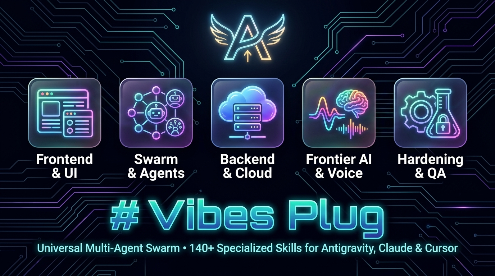

# Vibes Plug



### ⚡ Universal Agentic Swarm Workflow

```mermaid
graph TD
    %% Custom Styling
    classDef hero fill:#2d1b4e,stroke:#a855f7,stroke-width:2px,color:#fff;
    classDef step1 fill:#0f172a,stroke:#38bdf8,stroke-width:2px,color:#f8fafc;
    classDef step2 fill:#0f172a,stroke:#ec4899,stroke-width:2px,color:#f8fafc;
    classDef step3 fill:#0f172a,stroke:#10b981,stroke-width:2px,color:#f8fafc;
    classDef step4 fill:#0f172a,stroke:#f59e0b,stroke-width:2px,color:#f8fafc;
    classDef step5 fill:#0f172a,stroke:#6366f1,stroke-width:2px,color:#f8fafc;
    classDef target fill:#064e3b,stroke:#34d399,stroke-width:2px,color:#ecfdf5;

    AGY["🤖 Antigravity AI Agent<br/>Powered by vibes-plug (69+ Skills)"] ::: hero

    AGY --> P1["💡 1. Ideation & PRD<br/>brainstorming • prd-architect • gemini-agent-booster"] ::: step1
    P1 --> P2["🎨 2. Design System & UI/UX<br/>design-system-architect • ui-ux-pro-max • senior-frontend"] ::: step2
    P2 --> P3["⚙️ 3. Backend & AI Systems<br/>js-backend-expert • mcp-server-architect • multi-agent-orchestration"] ::: step3
    P3 --> P4["☁️ 4. SaaS & Cloud Integration<br/>saas-transformer • saas-billing • payment-gateway-expert"] ::: step4
    P4 --> P5["🔒 5. Audit & Production Hardening<br/>e2e-testing-expert • vibe-code-gardener • production-ready-hardener"] ::: step5
    P5 --> PROD["🚀 Production-Ready Release<br/>Scalable, Secure & Fully Tested"] ::: target
```

[English](#english) | [Bahasa Indonesia](#bahasa-indonesia)

---

<a name="english"></a>
## English

**2026 Edition** — Customization plugin for Antigravity containing **69+ specialized _skills_** updated for the modern 2026 tech stack (React 19, Next.js 15, Tailwind v4, Bun 1.2+, Hono v4, Node.js 24 LTS, Python 3.14, TypeScript 5.5+). Designed to support software development, UI/UX design, AI/LLM integration, SEO optimization, and SaaS business strategies.

### Installation

The easiest way to install or update `vibes-plug` is by cloning the Git repository directly into your Antigravity plugins directory.

**Windows (PowerShell / CMD):**
```bash
git clone https://github.com/roedyrustam/vibes-plug.git "$HOME\.gemini\config\plugins\vibes-plug"
```

**Mac / Linux (Terminal):**
```bash
git clone https://github.com/roedyrustam/vibes-plug.git ~/.gemini/config/plugins/vibes-plug
```

Once the command succeeds, Antigravity will automatically scan the folder and detect all plugins and skills.

> **Tip:** To update skills in the future, run `git pull` from inside the `vibes-plug` folder.

**Using curl & tar:**
```bash
mkdir -p ~/.gemini/config/plugins/vibes-plug && curl -L https://registry.npmjs.org/vibes-plug/-/vibes-plug-1.0.0.tgz | tar -xz -C ~/.gemini/config/plugins/vibes-plug --strip-components=1
```

---

### Features and Available Skills

This plugin provides the following 69+ skills that can be used by the agent:

#### 🤖 AI & Agentic Systems
- **AI & LLM Integration Expert** (`ai-llm-integration-expert`): Production-grade guidelines for integrating frontier LLMs (GPT-5, Claude 4, Gemini 3.1 Pro/Flash), MCP v1.9+ (Streamable HTTP), RAG pipelines with `pgvector` HNSW + BM25 hybrid search, agentic memory (Mem0/MemGPT), Vercel AI SDK 5.x, prompt caching, and computer use (Browser-Use, Playwright MCP).
- **MCP Server Architect** (`mcp-server-architect`): Expert guide for designing, building, and security-hardening Model Context Protocol (MCP) servers in TypeScript, Python, and Go. Covers MCP v1.9+ Streamable HTTP transport, Zod/Pydantic validation, OAuth 2.1, and multi-server orchestration.
- **Multi-Agent Orchestration Expert** (`multi-agent-orchestration`): Expert guide for designing stateful multi-agent AI systems — LangGraph graph-based workflows, CrewAI/AutoGen swarms, OpenAI Agents SDK handoffs, Google ADK, shared memory state, and Human-in-the-Loop guardrails.
- **Gemini Agent Booster** (`gemini-agent-booster`): Master optimization protocol for Gemini Agent (Antigravity) to unlock native 1M+ long-context reasoning, multimodal vision UI audits, visual subagent feedback, and high-speed problem solving.
- **DOKU MCP Server** (`doku-mcp-server`): Expert guide for DOKU Model Context Protocol (MCP) Server integration — AI Agentic Commerce with tools for payment links, Virtual Accounts, QRIS, transaction status checks, and client configuration for Claude Desktop, Cursor, and AGY.

#### 🎨 Design & UI/UX
- **Design System Architect** (`design-system-architect`): Expert guide for designing and maintaining scalable UI Design Systems with design tokens (OKLCH), Radix UI / Base UI headless primitives, Tailwind CSS v4 `@theme`, CVA variants, and WCAG 2.2 AAA accessibility.
- **HIG — Human Interface Guidelines** (`hig`): Applies the three core interface design principles — **Hierarchy** (clear visual structure), **Harmony** (element cohesion and platform alignment), and **Consistency** (uniformity across all screen sizes and devices).
- **Monday Design Aesthetic** (`monday-design-aesthetic`): Expert guide for implementing the modern, spacious, and highly structured Monday.com design system — clean grids, vibrant color system, and polished micro-interactions.
- **UI Components Expert** (`ui-components-expert`): Expert guide for building production-quality UI components following the 4 pillars: Input Controls, Navigation, Information, and Containers. Covers shadcn/ui, Radix UI, Motion (Framer Motion v12), React Hook Form + Zod, WCAG 2.2 accessibility, and micro-interaction checklists.
- **UI/UX Pro Max** (`ui-ux-pro-max`): Comprehensive design guide & BM25 search engine for web and mobile applications across 11 tech stacks. Contains guides for color palettes, typography, WCAG 2.2 AAA, micro-animations, and deep UX guidelines.
- **UI/UX Expert** (`ui_ux_expert`): Interface (Frontend) specialist and UI/UX Designer focusing on responsive and interactive layouts.

#### 🖥️ Frontend, Mobile & State
- **App Analyzer & Optimizer** (`app-analyzer-optimizer`): Deeply analyzes application structure and architecture, performs performance/security bottleneck audits (Core Web Vitals, INP), and executes targeted optimizations.
- **Bootstrap to Modern** (`bootstrap-to-modern`): Expert skill to refactor and migrate legacy Bootstrap CSS applications to modern stacks using Tailwind CSS v4 and Alpine.js / HTMX.
- **Mobile Expo Expert** (`mobile-expo-expert`): Expert guide for React Native 0.79+ and Expo SDK 53+ development — Expo Router v4, New Architecture (Fabric & TurboModules), EAS builds, OTA updates, and NativeWind v4.
- **MPA Orchestrator** (`mpa-orchestrator`): Orchestrates Multi-Page Application (MPA) architecture within a single repository, integrating Alpine.js / HTMX for progressive enhancement.
- **Multiple Entry Points** (`multiple-entry-points`): Expert guide for designing and implementing Multiple Entry Points architecture in web applications — separate bundles for landing, app, admin, and embedded widgets.
- **Performance & Web Vitals** (`performance-web-vitals`): Expert guide for Web Performance optimization — Core Web Vitals (LCP, INP, CLS), JavaScript bundle analysis, image/font loading strategies, React 19 concurrent features, virtual lists, and Lighthouse score improvement.
- **Realtime Collaboration Expert** (`realtime-collaboration-expert`): Expert guide for building real-time collaboration features using WebSockets, WebRTC, CRDTs (Yjs, Automerge), and Liveblocks — for collaborative editors, cursors, and live presence.
- **Senior Frontend** (`senior-frontend`): React 19, Next.js 15 (App Router, PPR, View Transitions), TypeScript, and Tailwind CSS v4 development expert. Covers `useActionState`, `useOptimistic`, `use()`, GSAP animations, and WCAG 2.2 compliance.
- **SPA Orchestrator** (`spa-orchestrator`): Orchestrates Single-Page Application (SPA) architecture with TanStack Router, TanStack Query v5, and decoupled API-driven backends.
- **State Management Expert** (`state-management-expert`): Expert guide for modern client-side state management — Zustand 5, Jotai 2, Valtio, TanStack Store, Redux Toolkit 2, and TanStack Query v5 for server state.
- **Tailwind CSS Expert** (`tailwind-expert`): Deep guide for Tailwind CSS v4 CSS-first configuration (`@theme`), OKLCH colors, 3D transforms, `field-sizing`, container queries, custom variants, and migration from v3.
- **TanStack Query Expert** (`tanstack-query-expert`): Expert in asynchronous state management with TanStack Query v5 — `useSuspenseQuery`, infinite scrolling, optimistic mutations, SSR/RSC hydration, and advanced cache invalidation.
- **Tauri Expert** (`tauri-expert`): Best practice guide for cross-platform applications with Tauri v2 (Desktop & Mobile), Rust backend, IPC communication, and security capabilities.

#### ⚙️ Backend, Languages & Runtimes
- **API Design Expert** (`api-design-expert`): Expert guide for REST, GraphQL, gRPC, tRPC, OpenAPI 3.1, API versioning, rate limiting (sliding window), idempotency keys, and contract-first development.
- **Bun Runtime Expert** (`bun-runtime-expert`): Expert guide for Bun v1.2+ — built-in APIs (`Bun.serve`, `Bun.sql`, `Bun.s3`), `bun test`, `bun build`, and migration strategies from Node.js.
- **Go Programming Expert** (`go-programming-expert`): Expert-level skill for Go 1.23/1.24+ — high-performance microservices, concurrency patterns (`errgroup`, context propagation), `sqlc`, `net/http`, Gin/Echo/Fiber, gRPC, and table-driven testing.
- **JS Backend Expert** (`js-backend-expert`): Production-grade guidance for Node.js 24 LTS, Bun 1.2+, and Deno 2.x. Covers Fastify 5, Hono v4 (RPC, secure headers, rate limiter), Express 5, NestJS, Drizzle ORM, Prisma 6, BullMQ, OpenTelemetry, and graceful shutdown.
- **PHP MVC Expert** (`mvc-expert`): Guidelines for modernizing legacy PHP projects into clean, secure, and structured OOP/MVC architectures following PSR standards and PHP 8.3/8.4+ features.
- **Python Programming Expert** (`python-programming-expert`): Expert-level guide for Python 3.13/3.14+ — JIT compiler, free-threaded mode (no GIL), PEP 695/696 generics, Pydantic v2, FastAPI 0.115+, SQLAlchemy 2.x async, `uv` package manager, Ruff, and pytest-asyncio.
- **Rust Programming Expert** (`rust-programming-expert`): Guide for Rust 2024 / v1.85+ — memory safety (ownership/lifetimes), async programming (Tokio), web backends (Axum 0.8+, SQLx 0.8+), CLI (Clap, Serde), and performance optimization.
- **TypeScript Expert** (`typescript-expert`): Expert guide for TypeScript 5.5+ — inferred type predicates, isolated declarations, iterator helpers (ES2025), `NoInfer<T>`, `using` declarations, branded types, discriminated unions, `satisfies`, and `moduleResolution: Bundler` for bundler-based projects.

#### ☁️ SaaS Architecture, Systems & Cloud
- **CI/CD & DevOps Architect** (`ci-cd-devops-architect`): Expert guide for continuous integration, deployment pipelines, Docker, Kubernetes, GitHub Actions, and Infrastructure as Code (IaC) with Terraform and Pulumi.
- **Cloud Hosting Expert** (`cloud-hosting-expert`): Expert guide for deploying SaaS on Vercel (Edge, Fluid Compute), Cloudflare Workers/Pages, Supabase, and Neon — with multi-region strategies and edge caching.
- **Event-Driven Architect** (`event-driven-architect`): Microservices, message queues (NATS, Kafka, RabbitMQ, EventBridge), Event Sourcing, CQRS, and background workflows (Temporal, Inngest, Trigger.dev v3).
- **Fullstack Expert** (`fullstack-expert`): Expert-level fullstack references covering TypeScript, Python, Go, Rust, API design, databases, DevOps, and observability.
- **Monorepo & Workspace Architect** (`monorepo-architect`): Expert guide for scalable monorepos using Turborepo 2.x, pnpm v9+ workspaces, and pnpm catalogs.
- **Payment Gateway Expert** (`payment-gateway-expert`): Expert guide for integrating payment gateways (Stripe, PayPal, Xendit, Midtrans, DOKU) and secure webhooks into SaaS platforms — HMAC signature verification, webhook idempotency, and billing state machines.
- **DOKU Payment Gateway** (`doku-payment-gateway`): Expert guide for DOKU Jokul API v2 — HMAC-SHA256 header signature calculation, Checkout & Direct APIs (VA, QRIS, E-Wallet, Credit Card), webhook notification verification, and sandbox/production setup.
- **PRD Architect** (`prd-architect`): Enforces the mandatory formulation of a Product Requirements Document (PRD) covering MVPs and user flows before the agent writes any new application code.
- **SaaS Billing & Subscriptions** (`saas-billing`): Implement and audit SaaS billing systems, subscription state machines, secure webhooks, and local database synchronization (Stripe v16+, Polar.sh, Midtrans, Paddle).
- **SaaS Multi-Tenant** (`saas-multi-tenant`): Designing and implementing multi-tenant SaaS architecture with Shared Schema (RLS) and Isolated Schema using PostgreSQL and Supabase.
- **SaaS MVP Launcher** (`saas-mvp-launcher`): Structured roadmap to plan and launch a SaaS MVP — authentication, payments, multi-tenancy, team management, and feature gating.
- **SaaS Transformer** (`saas-transformer`): Master orchestrator for transforming existing applications into fully-featured production-ready multi-tenant SaaS platforms (8-phase transformation).
- **Senior Fullstack** (`senior-fullstack`): Complete toolkit for senior fullstack developers — AI-native 2026 stack (Next.js 15 + Hono + Drizzle + Vercel AI SDK), Hono RPC, RFC 9457 error format, monorepo shared types, and security checklist.

#### 🗄️ Database & ORM
- **Database & ORM Expert** (`database-orm-expert`): Expert guide for Prisma 6 (schema-first, Studio, `$transaction`) and Drizzle ORM (SQL-first, edge-compatible, composable queries). Covers cursor-based pagination, N+1 prevention, index strategy, connection pooling, and migration best practices for PostgreSQL, MySQL, and SQLite.
- **Supabase Migration** (`supabase-migration`): Create, manage, or apply database migrations for Supabase locally or remotely via Supabase CLI v2+.

#### 🔒 Quality, Testing & Security
- **Authentication & Identity Expert** (`authentication-identity-expert`): Expert guide for implementing secure authentication with Clerk, Supabase Auth, Auth.js v5, and Better Auth. Covers OAuth 2.1 + PKCE, WebAuthn/Passkeys, RBAC enforcement, JWT best practices, and MFA integration for Next.js 15.
- **E2E Testing & Test Automation** (`e2e-testing-expert`): Expert guide for Playwright 1.48+, Vitest 2+, MSW 2+, and CI/CD automated pipeline setup.
- **Firebase Security Expert** (`firebase-security-expert`): Firebase security audit for Security Rules (Firestore/Realtime Database/Storage), authentication, API keys, data leakage prevention, and App Check v11+.
- **Production-Ready Hardener** (`production-ready-hardener`): Ultimate production readiness skill orchestrating security, performance, SEO, testing, and DevOps audits before deployment.
- **Scalability & Clean Code Expert** (`scalability-clean-code`): Guide to Clean Code, SOLID, DRY, and designing scalable modular application architectures.
- **Secure Fuzz Testing** (`secure-fuzz-testing`): Expert-level skill for coverage-guided fuzz tests (Atheris, cargo-fuzz, native Go fuzzing) with sanitizers (ASan, MSan, UBSan).
- **Supabase Security Expert** (`supabase-security-expert`): Supabase security audit for RLS (Row Level Security), RBAC, relational databases, data leakage prevention, and Supabase Linter.
- **Zero to Production Orchestrator** (`zero-to-prod-orchestrator`): Master orchestrator for the complete lifecycle of building a new application from scratch to production-ready release.

#### 🔍 SEO & Search Optimization
- **SEO Umbrella** (`seo`): Comprehensive SEO audit covering technical SEO, on-page SEO, schema markup, sitemaps, content quality, AI search readiness, and GEO.
- **SEO GEO** (`seo-geo`): Generative Engine Optimization (GEO) for AI Overviews, ChatGPT Search, Perplexity, and `/llms.txt` integration.
- **SEO AEO Landing Page Writer** (`seo-aeo-landing-page-writer`): Structured landing page writer optimized for SEO ranking and AEO (Answer Engine Optimization) citations.

#### 🛠️ Utilities & Tools
- **Auto Documentation Updater** (`auto-doc-updater`): Automatically documents every feature change or bug fix into `CHANGELOG.md` and `BLUEPRINT.md`.
- **Brainstorming** (`brainstorming`): Master ideation protocol & architectural orchestrator. Validates design ideas and orchestrates all vibes-plug skills before coding begins — 8-step structured dialogue with hard gates and skill delegation matrix.
- **CodeRabbit Expert** (`coderabbit`): AI-powered automated code review, pull request summarization, and interactive developer feedback for GitHub/GitLab.
- **Data Telemetry Expert** (`data-telemetry-expert`): Observability, OpenTelemetry 1.30+, PostHog, Mixpanel, and data pipeline analytics.
- **Friendly Assistant** (`asisten_ramah`): Adds a friendly, warm, and enthusiastic personality to the agent's responses.
- **Global Accessibility & Internationalization** (`global-a11y-i18n-expert`): Web Accessibility (WCAG 2.2 AAA) and i18n internationalization standards.
- **New Skill Template** (`skill_baru`): Comprehensive template for creating new vibes-plug skills with proper structure, trigger conditions, and bilingual support.
- **Session Handoff & Memory Resume** (`session-handoff-resume`): Saves ultra-compact project checkpoints (`STATE_HANDOFF.md`) before account/session switches and resumes work with zero token waste.
- **Token Saver** (`token-saver`): Strong instructions to minimize fluff and repetition — very useful for high-efficiency bulk refactoring tasks.
- **Vibe Code Gardener** (`vibe-code-gardener`): Purger of AI slop, code bloat, context drift, and architectural decay in vibe-coded projects — systematic cleanup and refactoring of LLM-generated code.
- **Web Scraper** (`web-scraper`): Smart web data extraction with multi-strategy scraping (Crawl4AI, Playwright, BeautifulSoup), LLM extraction, pagination support, and structured JSON/CSV export.

---

### Universal Orchestration Workflow (The Power of Vibes Plug)

To unlock the full potential of `vibes-plug`, skills are designed to act as a **highly orchestrated, interconnected swarm** that builds upon each other:

1. **Ideation & Planning:** Start with `brainstorming` and `prd-architect` to validate requirements, architectures, and design ideas. Trigger `gemini-agent-booster` for deep architectural reasoning.
2. **Design & Frontend:** Trigger `design-system-architect` and `ui-ux-pro-max` to establish tokens, then use `senior-frontend` alongside `ui-components-expert` and `tanstack-query-expert` to build robust, accessible UIs.
3. **Backend & Architecture:** Orchestrate `js-backend-expert` (or `go-programming-expert` / `rust-programming-expert`) with `event-driven-architect` for high-performance, scalable backends. Add `authentication-identity-expert` for secure auth flows.
4. **AI Integration:** Invoke `ai-llm-integration-expert` and `mcp-server-architect` for LLM integrations and MCP tooling. Use `multi-agent-orchestration` for complex agentic workflows.
5. **SaaS Transformation:** Invoke `saas-transformer` or `saas-mvp-launcher` — these master skills automatically coordinate `saas-multi-tenant`, `saas-billing`, `payment-gateway-expert`, and `supabase-security-expert`.
6. **Quality & Launch:** Use `e2e-testing-expert`, `vibe-code-gardener`, and `seo` to validate. Finally, invoke `production-ready-hardener` to audit the entire system before Edge/Cloud deployment.

By letting skills naturally invoke one another, you transform the AI into a complete, end-to-end engineering team.

---

### Contributing

For those who want to contribute by adding new skills or updating existing ones, please read our complete guide at [CONTRIBUTING.md](CONTRIBUTING.md).

### Version
v2.1.0 (2026 Edition) — 69+ skills

### Repository
[https://github.com/roedyrustam/vibes-plug.git](https://github.com/roedyrustam/vibes-plug.git)

---

<a name="bahasa-indonesia"></a>
## Bahasa Indonesia

**Edisi 2026** — Plugin kustomisasi untuk Antigravity yang berisi **69+ _skills_ khusus** yang diperbarui untuk tech stack modern 2026 (React 19, Next.js 15, Tailwind v4, Bun 1.2+, Hono v4, Node.js 24 LTS, Python 3.14, TypeScript 5.5+). Dirancang untuk menunjang pengembangan perangkat lunak, desain UI/UX, integrasi AI/LLM, optimasi SEO, hingga strategi bisnis SaaS.

### Instalasi

Cara termudah untuk menginstal atau memperbarui `vibes-plug` adalah dengan melakukan *clone* repositori Git ke dalam direktori plugin Antigravity.

**Windows (PowerShell / CMD):**
```bash
git clone https://github.com/roedyrustam/vibes-plug.git "$HOME\.gemini\config\plugins\vibes-plug"
```

**Mac / Linux (Terminal):**
```bash
git clone https://github.com/roedyrustam/vibes-plug.git ~/.gemini/config/plugins/vibes-plug
```

Seketika setelah perintah di atas berhasil, Antigravity akan memindai folder dan mendeteksi seluruh plugin beserta *skills* secara otomatis.

> **Tip:** Untuk memperbarui skill di masa depan, cukup jalankan `git pull` dari dalam folder `vibes-plug`.

**Menggunakan curl & tar:**
```bash
mkdir -p ~/.gemini/config/plugins/vibes-plug && curl -L https://registry.npmjs.org/vibes-plug/-/vibes-plug-1.0.0.tgz | tar -xz -C ~/.gemini/config/plugins/vibes-plug --strip-components=1
```

---

### Fitur dan Skills yang Tersedia

Plugin ini menyediakan **69+ kemampuan (*skills*)** berikut yang bisa digunakan oleh agen:

#### 🤖 AI & Sistem Agen
- **AI & LLM Integration Expert** (`ai-llm-integration-expert`): Panduan tingkat produksi untuk integrasi frontier LLM (GPT-5, Claude 4, Gemini 3.1 Pro/Flash), MCP v1.9+ (Streamable HTTP), pipeline RAG dengan pgvector HNSW + BM25 hybrid search, memori agentik (Mem0/MemGPT), Vercel AI SDK 5.x, prompt caching, dan computer use (Browser-Use, Playwright MCP).
- **MCP Server Architect** (`mcp-server-architect`): Panduan ahli merancang, membangun, dan mengamankan server MCP v1.9+ di TypeScript, Python, dan Go. Mencakup Streamable HTTP transport, validasi Zod/Pydantic, OAuth 2.1, dan orkestrasi multi-server.
- **Multi-Agent Orchestration Expert** (`multi-agent-orchestration`): Panduan ahli merancang sistem multi-agen AI stateful — alur kerja LangGraph, CrewAI/AutoGen, OpenAI Agents SDK handoffs, Google ADK, memori bersama, dan gerbang Human-in-the-Loop.
- **Gemini Agent Booster** (`gemini-agent-booster`): Protokol optimasi utama untuk Gemini Agent (Antigravity) — mengaktifkan pemikiran long-context 1M+, audit UI visual multimodal, dan pemecahan masalah kecepatan tinggi.
- **DOKU MCP Server** (`doku-mcp-server`): Panduan ahli integrasi DOKU MCP Server untuk AI Agentic Commerce — tools untuk payment link, Virtual Account, QRIS, cek status transaksi, dan konfigurasi klien (Claude Desktop, Cursor, AGY).

#### 🎨 Desain & UI/UX
- **Design System Architect** (`design-system-architect`): Panduan ahli merancang dan memelihara Design System UI — Design Tokens (OKLCH), Radix UI / Base UI headless primitives, Tailwind CSS v4 `@theme`, CVA variants, dan aksesibilitas WCAG 2.2 AAA.
- **HIG — Human Interface Guidelines** (`hig`): Menerapkan tiga prinsip desain antarmuka inti — **Hierarchy** (hirarki visual yang jelas), **Harmony** (harmoni antar elemen dan platform), dan **Consistency** (konsistensi di semua layar dan perangkat).
- **Monday Design Aesthetic** (`monday-design-aesthetic`): Panduan ahli mengimplementasikan sistem desain Monday.com yang modern, luas, dan terstruktur — grid bersih, sistem warna yang vibran, dan micro-interaction yang halus.
- **UI Components Expert** (`ui-components-expert`): Panduan ahli membangun komponen UI berkualitas produksi dengan 4 pilar: Kontrol Input, Navigasi, Informasi, dan Kontainer. Mencakup shadcn/ui, Radix UI, Motion (Framer Motion v12), React Hook Form + Zod, WCAG 2.2, dan checklist micro-interaction.
- **UI/UX Pro Max** (`ui-ux-pro-max`): Panduan desain komprehensif & mesin pencari BM25 untuk aplikasi web dan mobile di 11 tech stack. Berisi panduan palet warna, tipografi, WCAG 2.2 AAA, micro-animasi, dan pedoman UX mendalam.
- **UI/UX Expert** (`ui_ux_expert`): Spesialis antarmuka (Frontend) dan UI/UX Designer yang berfokus pada layout responsif dan interaktif.

#### 🖥️ Frontend, Mobile & State
- **App Analyzer & Optimizer** (`app-analyzer-optimizer`): Menganalisis struktur dan arsitektur aplikasi secara mendalam, melakukan audit bottleneck performa/keamanan (Core Web Vitals, INP), serta optimasi terarah.
- **Bootstrap to Modern** (`bootstrap-to-modern`): Skill ahli merefaktor dan memigrasikan aplikasi Bootstrap CSS lama ke stack modern menggunakan Tailwind CSS v4 dan Alpine.js / HTMX.
- **Mobile Expo Expert** (`mobile-expo-expert`): Panduan ahli pengembangan React Native 0.79+ dan Expo SDK 53+ — Expo Router v4, New Architecture (Fabric & TurboModules), EAS builds, OTA updates, dan NativeWind v4.
- **MPA Orchestrator** (`mpa-orchestrator`): Mengorkestrasi arsitektur Multi-Page Application (MPA) dalam satu repositori, mengintegrasikan Alpine.js / HTMX untuk progressive enhancement.
- **Multiple Entry Points** (`multiple-entry-points`): Panduan ahli merancang dan mengimplementasikan arsitektur Multiple Entry Points pada aplikasi web — bundle terpisah untuk landing, app, admin, dan embedded widget.
- **Performance & Web Vitals** (`performance-web-vitals`): Panduan ahli optimasi performa web — Core Web Vitals (LCP, INP, CLS), analisis bundle JavaScript, strategi loading gambar/font, fitur concurrent React 19, virtualisasi list, dan peningkatan skor Lighthouse.
- **Realtime Collaboration Expert** (`realtime-collaboration-expert`): Panduan ahli membangun fitur kolaborasi real-time menggunakan WebSockets, WebRTC, CRDT (Yjs, Automerge), dan Liveblocks — untuk editor kolaboratif, kursor live, dan indikator kehadiran.
- **Senior Frontend** (`senior-frontend`): Ahli React 19, Next.js 15 (App Router, PPR, View Transitions), TypeScript, dan Tailwind CSS v4. Mencakup `useActionState`, `useOptimistic`, `use()`, animasi GSAP, dan kepatuhan WCAG 2.2.
- **SPA Orchestrator** (`spa-orchestrator`): Mengorkestrasi arsitektur SPA dengan TanStack Router, TanStack Query v5, dan backend berbasis API yang terpisah.
- **State Management Expert** (`state-management-expert`): Panduan ahli manajemen state client-side modern — Zustand 5, Jotai 2, Valtio, TanStack Store, Redux Toolkit 2, dan TanStack Query v5 untuk server state.
- **Tailwind CSS Expert** (`tailwind-expert`): Panduan mendalam Tailwind CSS v4 CSS-first configuration (`@theme`), warna OKLCH, 3D transform, `field-sizing`, container queries, custom variants, dan migrasi dari v3.
- **TanStack Query Expert** (`tanstack-query-expert`): Pakar manajemen state asinkron TanStack Query v5 — `useSuspenseQuery`, infinite scrolling, mutasi optimistik, SSR/RSC hydration, dan invalidasi cache tingkat lanjut.
- **Tauri Expert** (`tauri-expert`): Panduan terbaik pengembangan aplikasi lintas platform dengan Tauri v2 (Desktop & Mobile), Rust backend, IPC komunikasi, dan *Capabilities* keamanan.

#### ⚙️ Backend, Bahasa & Runtime
- **API Design Expert** (`api-design-expert`): Panduan ahli REST, GraphQL, gRPC, tRPC, OpenAPI 3.1, API versioning, rate limiting (sliding window), idempotency key, dan pengembangan contract-first.
- **Bun Runtime Expert** (`bun-runtime-expert`): Panduan ahli runtime Bun v1.2+ — built-in APIs (`Bun.serve`, `Bun.sql`, `Bun.s3`), `bun test`, `bun build`, dan strategi migrasi dari Node.js.
- **Go Programming Expert** (`go-programming-expert`): Skill tingkat ahli untuk Go 1.23/1.24+ — API backend berkinerja tinggi, microservices, pola konkurensi (`errgroup`), `sqlc`, `net/http`, Gin/Echo/Fiber, gRPC, dan pengujian berbasis tabel.
- **JS Backend Expert** (`js-backend-expert`): Panduan tingkat produksi untuk Node.js 24 LTS, Bun 1.2+, dan Deno 2.x. Mencakup Fastify 5, Hono v4 (RPC, secure headers, rate limiter), Express 5, NestJS, Drizzle ORM, Prisma 6, BullMQ, OpenTelemetry, dan graceful shutdown.
- **PHP MVC Expert** (`mvc-expert`): Panduan memodernisasi proyek PHP lama menjadi arsitektur OOP/MVC yang bersih dan terstruktur mengikuti standar PSR dan fitur PHP 8.3/8.4+.
- **Python Programming Expert** (`python-programming-expert`): Panduan tingkat ahli Python 3.13/3.14+ — JIT compiler, mode free-threaded (tanpa GIL), PEP 695/696 generics, Pydantic v2, FastAPI 0.115+, SQLAlchemy 2.x async, `uv`, Ruff, dan pytest-asyncio.
- **Rust Programming Expert** (`rust-programming-expert`): Panduan Rust 2024 / v1.85+ — keamanan memori, pemrograman async (Tokio), web backend (Axum 0.8+, SQLx 0.8+), CLI (Clap, Serde), dan optimasi performa.
- **TypeScript Expert** (`typescript-expert`): Panduan ahli TypeScript 5.5+ — inferred type predicates, isolated declarations, iterator helpers (ES2025), `NoInfer<T>`, deklarasi `using`, branded types, discriminated unions, `satisfies`, dan `moduleResolution: Bundler` untuk proyek berbasis bundler.

#### ☁️ Arsitektur SaaS, Sistem & Cloud
- **CI/CD & DevOps Architect** (`ci-cd-devops-architect`): Panduan ahli continuous integration, pipeline deployment, Docker, Kubernetes, GitHub Actions, dan Infrastructure as Code (IaC) dengan Terraform dan Pulumi.
- **Cloud Hosting Expert** (`cloud-hosting-expert`): Panduan ahli deployment SaaS di Vercel (Edge, Fluid Compute), Cloudflare Workers/Pages, Supabase, dan Neon — dengan strategi multi-region dan edge caching.
- **Event-Driven Architect** (`event-driven-architect`): Arsitektur microservices, message queues (NATS, Kafka, RabbitMQ, EventBridge), Event Sourcing, CQRS, dan background workflows (Temporal, Inngest, Trigger.dev v3).
- **Fullstack Expert** (`fullstack-expert`): Referensi fullstack tingkat ahli — TypeScript, Python, Go, Rust, desain API, database, DevOps, dan observability.
- **Monorepo & Workspace Architect** (`monorepo-architect`): Panduan ahli monorepo skalabel menggunakan Turborepo 2.x, pnpm v9+ workspaces, dan pnpm catalogs.
- **Payment Gateway Expert** (`payment-gateway-expert`): Panduan ahli integrasi payment gateway (Stripe, PayPal, Xendit, Midtrans, DOKU) dan webhook aman ke platform SaaS — verifikasi HMAC, idempotency webhook, dan billing state machine.
- **DOKU Payment Gateway** (`doku-payment-gateway`): Panduan ahli integrasi DOKU Jokul API v2 — kalkulasi signature HMAC-SHA256, Checkout & Direct API (VA, QRIS, E-Wallet, Kartu Kredit), verifikasi notifikasi webhook, dan setup sandbox/produksi.
- **PRD Architect** (`prd-architect`): Memaksa perumusan *Product Requirements Document* (PRD) yang meliputi MVP dan user flows secara wajib sebelum agen menulis kode aplikasi baru.
- **SaaS Billing & Langganan** (`saas-billing`): Implementasi dan audit sistem billing SaaS, state machine langganan, webhook aman, dan sinkronisasi database lokal (Stripe v16+, Polar.sh, Midtrans, Paddle).
- **SaaS Multi-Tenant** (`saas-multi-tenant`): Merancang dan mengimplementasikan arsitektur SaaS multi-tenant dengan Shared Schema (RLS) dan Isolated Schema menggunakan PostgreSQL dan Supabase.
- **SaaS MVP Launcher** (`saas-mvp-launcher`): Roadmap terstruktur untuk merencanakan dan meluncurkan SaaS MVP — autentikasi, pembayaran, multi-tenancy, manajemen tim, dan feature gating.
- **SaaS Transformer** (`saas-transformer`): Skill master orkestrator untuk transformasi sistematis 8-fase dari aplikasi biasa menjadi platform SaaS multi-tenant lengkap siap produksi.
- **Senior Fullstack** (`senior-fullstack`): Perangkat instruksi lengkap untuk fullstack senior — stack AI-native 2026 (Next.js 15 + Hono + Drizzle + Vercel AI SDK), Hono RPC, format error RFC 9457, shared types monorepo, dan security checklist.

#### 🗄️ Database & ORM
- **Database & ORM Expert** (`database-orm-expert`): Panduan ahli Prisma 6 (schema-first, Studio, `$transaction`) dan Drizzle ORM (SQL-first, edge-compatible, composable query). Mencakup cursor-based pagination, pencegahan N+1, strategi index, connection pooling, dan praktik terbaik migrasi untuk PostgreSQL, MySQL, dan SQLite.
- **Supabase Migration** (`supabase-migration`): Membuat, mengelola, atau menerapkan migrasi database Supabase secara lokal maupun remote via Supabase CLI v2+.

#### 🔒 Kualitas, Pengujian & Keamanan
- **Authentication & Identity Expert** (`authentication-identity-expert`): Panduan ahli autentikasi aman dengan Clerk, Supabase Auth, Auth.js v5, dan Better Auth. Mencakup OAuth 2.1 + PKCE, WebAuthn/Passkeys, penegakan RBAC server-side, best practices JWT, dan integrasi MFA untuk Next.js 15.
- **E2E Testing & Otomatisasi Tes** (`e2e-testing-expert`): Panduan ahli Playwright 1.48+, Vitest 2+, MSW 2+, dan otomatisasi pipeline CI/CD.
- **Firebase Security Expert** (`firebase-security-expert`): Audit keamanan Firebase untuk Security Rules (Firestore/Realtime Database/Storage), autentikasi, API keys, pencegahan kebocoran data, dan App Check v11+.
- **Production-Ready Hardener** (`production-ready-hardener`): Skill kesiapan produksi utama yang mengorkestrasi audit keamanan, performa, SEO, testing, dan DevOps sebelum deployment.
- **Scalability & Clean Code Expert** (`scalability-clean-code`): Panduan Clean Code, SOLID, DRY, dan merancang arsitektur aplikasi modular yang skalabel.
- **Secure Fuzz Testing** (`secure-fuzz-testing`): Panduan tingkat ahli pengujian fuzzing berbasis cakupan (Atheris, cargo-fuzz, native Go fuzzing) dengan sanitizer (ASan, MSan, UBSan).
- **Supabase Security Expert** (`supabase-security-expert`): Audit keamanan Supabase untuk RLS (Row Level Security), RBAC, database relasional, pencegahan kebocoran data, dan Supabase Linter.
- **Zero to Production Orchestrator** (`zero-to-prod-orchestrator`): Skill master orkestrator yang memandu siklus hidup lengkap pembangunan aplikasi baru dari nol hingga rilis siap produksi.

#### 🔍 SEO & Optimasi Visibilitas
- **SEO Umbrella** (`seo`): Audit SEO menyeluruh — technical SEO, SEO on-page, schema markup, sitemaps, kualitas konten, AI search readiness, dan GEO.
- **SEO GEO** (`seo-geo`): Generative Engine Optimization (GEO) untuk AI Overviews, ChatGPT Search, Perplexity, dan integrasi `/llms.txt`.
- **SEO AEO Landing Page Writer** (`seo-aeo-landing-page-writer`): Penulis landing page terstruktur untuk peringkat tinggi di SEO dan sitasi AEO (Answer Engine Optimization).

#### 🛠️ Utilitas & Alat
- **Auto Documentation Updater** (`auto-doc-updater`): Otomatis mendokumentasikan setiap perubahan fitur atau perbaikan bug ke `CHANGELOG.md` dan `BLUEPRINT.md`.
- **Brainstorming** (`brainstorming`): Protokol ideasi utama & orkestrator arsitektur. Memvalidasi ide desain dan mengorkestrasi seluruh skill vibes-plug sebelum pengkodean dimulai — dialog terstruktur 8-langkah dengan hard gates dan matriks delegasi skill.
- **CodeRabbit Expert** (`coderabbit`): Asisten review kode otomatis berbasis AI, perangkum pull request, dan umpan balik developer interaktif di GitHub/GitLab.
- **Data Telemetry Expert** (`data-telemetry-expert`): Observabilitas, OpenTelemetry 1.30+, PostHog, Mixpanel, dan analitik pipa data.
- **Asisten Ramah** (`asisten_ramah`): Menambahkan kepribadian yang ramah, hangat, dan bersemangat pada respons agen.
- **Global Accessibility & Internationalization** (`global-a11y-i18n-expert`): Standar Aksesibilitas Web (WCAG 2.2 AAA) dan internasionalisasi i18n.
- **Template Skill Baru** (`skill_baru`): Template komprehensif untuk membuat skill vibes-plug baru dengan struktur yang tepat, kondisi pemicu, dan dukungan bilingual.
- **Session Handoff & Memory Resume** (`session-handoff-resume`): Menyimpan checkpoint proyek super ringkas (`STATE_HANDOFF.md`) sebelum ganti akun/sesi dan melanjutkan pekerjaan secara instan tanpa boros token.
- **Token Saver** (`token-saver`): Instruksi kuat untuk meminimalkan *fluff* dan pengulangan — sangat berguna untuk tugas refactoring massal dengan efisiensi tinggi.
- **Vibe Code Gardener** (`vibe-code-gardener`): Pembersih AI slop, kode membengkak, konteks drift, dan pembusukan arsitektur pada proyek vibe coding — pembersihan dan refactoring sistematis kode yang dihasilkan LLM.
- **Web Scraper** (`web-scraper`): Kemampuan ekstraksi data web cerdas dengan strategi scraping modern (Crawl4AI, Playwright, BeautifulSoup), ekstraksi LLM, paginasi, dan ekspor JSON/CSV terstruktur.

---

### Alur Orkestrasi Universal (Kekuatan Penuh Vibes Plug)

Untuk membuka potensi penuh dari `vibes-plug`, *skill* dirancang untuk bertindak sebagai **ekosistem (*swarm*) yang saling terhubung dan terorkestrasi**:

1. **Ideasi & Perencanaan:** Mulai dengan `brainstorming` dan `prd-architect` untuk memvalidasi persyaratan dan arsitektur. Aktifkan `gemini-agent-booster` untuk penalaran arsitektur mendalam.
2. **Desain & Frontend:** Picu `design-system-architect` dan `ui-ux-pro-max` untuk membuat design tokens, lalu gunakan `senior-frontend` bersama `ui-components-expert` dan `tanstack-query-expert` untuk membangun UI yang kuat dan aksesibel.
3. **Backend & Arsitektur:** Orkestrasikan `js-backend-expert` (atau `go-programming-expert` / `rust-programming-expert`) dengan `event-driven-architect` untuk backend berkinerja tinggi. Tambahkan `authentication-identity-expert` untuk alur autentikasi yang aman.
4. **Integrasi AI:** Panggil `ai-llm-integration-expert` dan `mcp-server-architect` untuk integrasi LLM dan tooling MCP. Gunakan `multi-agent-orchestration` untuk alur kerja agentik yang kompleks.
5. **Transformasi SaaS:** Panggil `saas-transformer` atau `saas-mvp-launcher` — skill master ini otomatis mengoordinasikan `saas-multi-tenant`, `saas-billing`, `payment-gateway-expert`, dan `supabase-security-expert`.
6. **Kualitas & Peluncuran:** Gunakan `e2e-testing-expert`, `vibe-code-gardener`, dan `seo` untuk validasi. Terakhir, panggil `production-ready-hardener` untuk mengaudit seluruh sistem sebelum rilis ke Edge/Cloud.

Dengan membiarkan *skill-skill* ini saling memicu secara natural, Anda mengubah agen AI menjadi **tim engineering end-to-end yang lengkap dan sangat powerful**.

---

### Kontribusi

Bagi Anda yang ingin berkontribusi menambahkan skill baru atau memperbarui skill yang ada, silakan baca panduan lengkap kami di [CONTRIBUTING.md](CONTRIBUTING.md).

### Versi
v2.1.0 (Edisi 2026) — 69+ skills

### Repositori
[https://github.com/roedyrustam/vibes-plug.git](https://github.com/roedyrustam/vibes-plug.git)
