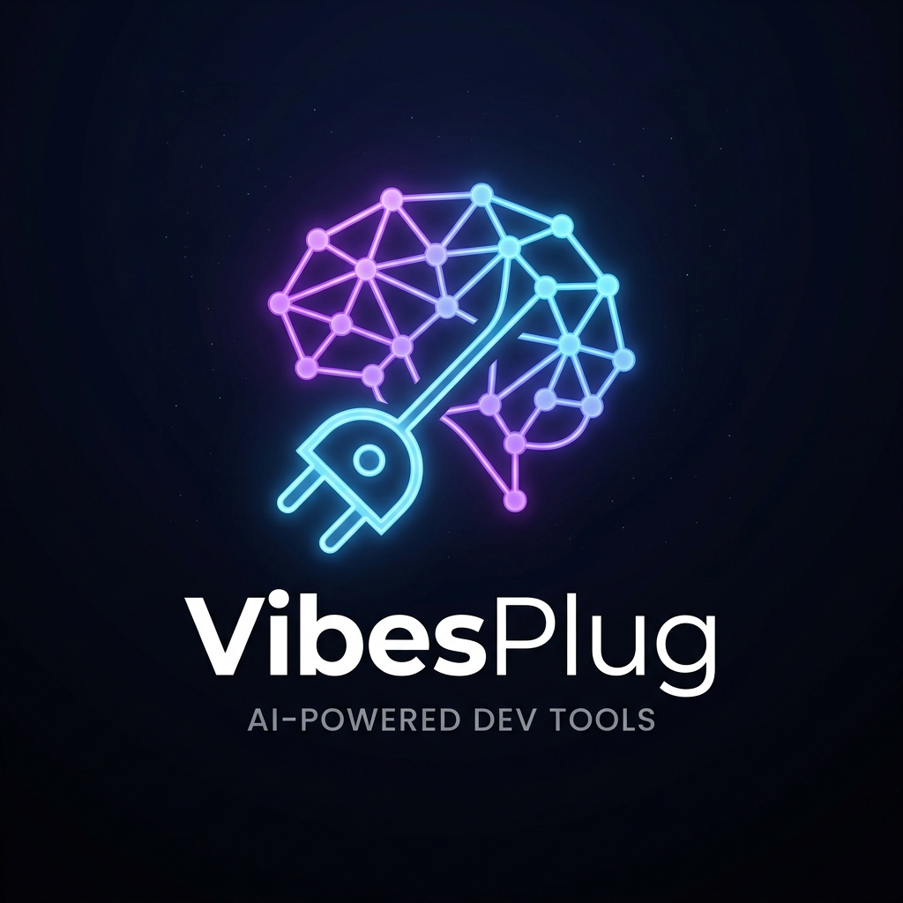
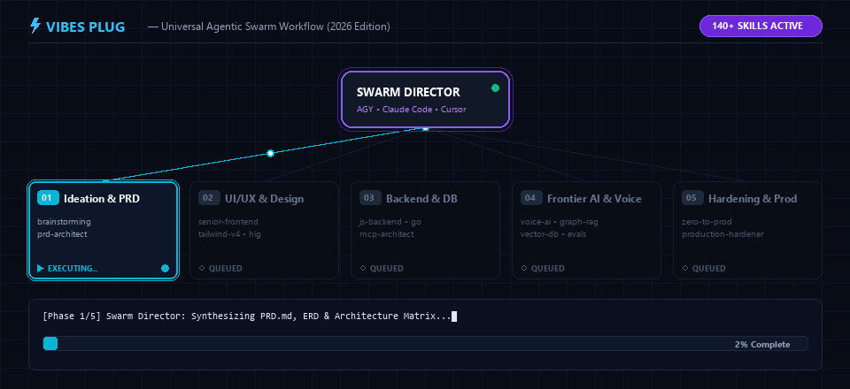

<div align="center">
  

# ⚡ VibesPlug Pro: 132-Skill AI Agent Swarm Architecture

**Turn any IDE into an autonomous 132-agent software development studio.**  
*Zero AI Slop • Zero Tech Debt • Pure Production Velocity*

<p align="center">
  <a href="https://github.com/roedyrustam/vibes-plug/stargazers"></a>
  <a href="https://github.com/roedyrustam/vibes-plug/network/members"></a>
  <a href="https://www.npmjs.com/package/vibes-plug"></a>
  <a href="https://www.npmjs.com/package/vibes-plug"></a>
  <a href="https://github.com/roedyrustam/vibes-plug/blob/master/LICENSE"></a>
  <a href="https://twitter.com/intent/tweet?text=Turn%20any%20IDE%20into%20a%20132-agent%20autonomous%20software%20studio%20with%20VibesPlug!%20%F0%9F%9A%80%20https%3A%2F%2Fgithub.com%2Froedyrustam%2Fvibes-plug%20%23VibeCoding%20%23AIAgents"></a>
</p>

<p align="center">
  <a href="https://github.com/roedyrustam/vibes-plug">⭐ <b>Star this repo</b></a> to support the project & help it trend!
</p>

[🇬🇧 English](#english) | [🇮🇩 Bahasa Indonesia](#bahasa-indonesia) | [🇨🇳 中文 (Mandarin)](#mandarin) | [🇩🇪 Deutsch (German)](#german) | [🇯🇵 日本語 (Japanese)](#japanese) | [📈 Star History](#star-history)
</div>

---

### 🎬 Swarm Director in Action

<div align="center">
  
</div>

<br />

```bash
# ⚡ Instant 1-Command Scaffold (No Config Needed)
npx vibes-plug init
```

---

## 💥 Why VibesPlug? (The Paradigm Shift)

| Metric / Capability | Vanilla Vibe Coding (Prompts) | Static IDE Rules (.cursorrules) | ⚡ VibesPlug Pro (Swarm) |
| :--- | :--- | :--- | :--- |
| **Agent Coordination** | ❌ 1 confused LLM doing everything | ⚠️ Static rules without orchestration |  **Swarm Director & 132 Specialists** |
| **Full-Stack Lifecycle** | ❌ Fragmented & prone to regressions | ⚠️ Ad-hoc guidance |  **Autonomous 9-Phase Zero-To-Prod** |
| **Tech Stack** | ⚠️ Often outputs legacy 2022 patterns | ⚠️ Stale prompts |  **React 19, Next 15, Tailwind v4, Bun 1.2+** |
| **Code Gardening & QA** | ❌ Hallucinated dead code & slop | ❌ No automated debt check |  **Zero-Tech-Debt Auditor & Red Teaming** |
| **Payment & Micro-Economy** | ❌ Incomplete integrations | ⚠️ Basic docs |  **DOKU SNAP, Stripe, M2M Agent Wallets** |
| **IDE Portability** | ❌ Locked to one interface | ⚠️ Cursor only |  **Antigravity, Cursor, Claude Code, Windsurf, Trae, VSCode** |

---

## 🧩 The 132-Skill Arsenal (Category Breakdown)

VibesPlug is powered by 132 specialized AI subagents. Here is a high-level grouping of the engine's core capabilities:

| 🎨 **Frontend & UI/UX** | ⚙️ **Backend & Architecture** |
| :--- | :--- |
| `senior-frontend` <br> `app-promo-media-expert` <br> `ephemeral-generative-ui-architect` <br> `tailwind-expert` <br> `modern-css-native-expert` <br> `ui-ux-pro-max` <br> `micro-frontend-architect` | `js-backend-expert` <br> `go-programming-expert` <br> `rust-programming-expert` <br> `api-design-expert` <br> `database-orm-expert` <br> `domain-driven-design-expert` |

| 🤖 **Frontier AI & LLM** | 💸 **FinOps & Micro-Economy** |
| :--- | :--- |
| `affective-computing-emotion-ai` <br> `gemini-agent-booster` <br> `vercel-ai-sdk-expert` <br> `mcp-server-architect` <br> `pydantic-ai-expert` | `agentic-micro-economy-architect` <br> `saas-billing` <br> `doku-payment-gateway` <br> `payment-gateway-expert` <br> `ecommerce-expert` |

| 🛡️ **DevOps, QA & Orchestration** | 🌐 **Web Ecosystem & Platforms** |
| :--- | :--- |
| `zero-to-prod-orchestrator` <br> `zero-tech-debt-auditor` *(Phase 9)* <br> `autonomous-red-teamer` <br> `ci-cd-devops-architect` <br> `brainstorming` | `chrome-extensions` <br> `mobile-expo-expert` <br> `desktop-electron-expert` <br> `pwa-offline-first-expert` <br> `blockchain-web3-expert` |

---

<a name="english"></a>
## 🇬🇧 English Version

Welcome to **VibesPlug Pro**. Unlike generic prompt libraries, VibesPlug acts as a **Swarm Director**, orchestrating 132 specialized AI subagents. It is strictly engineered to extract maximum reasoning capabilities from ALL Frontier Models (Gemini 4 Pro, Claude 4, GPT-4.5/O3, OpenAI Codex, and DeepSeek).

### 🚀 Universal Installation Guide (All IDEs & LLMs)
*Supported Platforms: Antigravity, Cursor, Windsurf, Trae, Kimi, Kiro, VSCode (Cline), and Claude Code.*

#### Method 1: CLI (NPM Installation - Recommended)
The CLI automatically scaffolds the required master rules for your specific IDE.
```bash
npm i -g vibes-plug
vibes-plug init
```

#### Method 2: Manual Installation per IDE
If you download the `.zip` archive, extract it and configure your IDE as follows:
- **Antigravity (Google):** Move the folder to `~/.gemini/config/plugins/vibes-plug`.
- **Cursor IDE:** Copy `.cursorrules` to your project root.
- **Windsurf IDE:** Copy `.windsurfrules` to your project root.
- **Trae IDE:** Copy `.traerules` to your project root.
- **Kimi / Kiro:** Copy `.kimirules` or `.kirorules` to your project root.
- **VSCode (Cline/Roo):** Copy `.clinerules` to your project root.
- **Claude Code:** Copy `CLAUDE.md` and `.claude/rules/` to your project root.

### 💻 How to Use the Plugin & CLI

**1. Zero-Friction Prompting (In-IDE)**
You do *not* need to tag skills manually. Just open your IDE's AI Chat (driven by any LLM) and type:
> *"Build me a micro-SaaS platform with Stripe payments and a Next.js 15 Tailwind v4 dark mode UI."*

The Swarm Director will automatically invoke the necessary skills and execute the 9-Phase Zero-To-Prod workflow.

**2. CLI Commands (Terminal)**
VibesPlug comes with a powerful terminal toolkit:
- `vibes-plug init` - Injects the 132-skill Swarm Architecture into your current workspace.
- `vibes-plug audit` - Triggers the `zero-tech-debt-auditor` to scan for dead code and magic numbers manually.
- `vibes-plug list` - Displays all active agentic skills loaded in memory.

---

<a name="bahasa-indonesia"></a>
## 🇮🇩 Versi Bahasa Indonesia

Selamat datang di **VibesPlug Pro**. Sistem ini bertindak sebagai **Swarm Director (Sutradara Utama)** untuk mengorkestrasi 132 sub-agen AI spesialis. Sistem ini direkayasa secara ketat untuk mengekstrak penalaran maksimum dari SEMUA Model Frontier terkini (Gemini 4 Pro, Claude 4, GPT-4.5/O3, OpenAI Codex, dan DeepSeek).

### 🚀 Panduan Instalasi Universal (Semua IDE & LLM)
*Platform Didukung: Antigravity, Cursor, Windsurf, Trae, Kimi, Kiro, VSCode (Cline), dan Claude Code.*

#### Metode 1: CLI (Instalasi NPM - Rekomendasi)
CLI akan otomatis mengonfigurasi aturan utama (*master rules*) sesuai dengan IDE yang Anda gunakan.
```bash
npm i -g vibes-plug
vibes-plug init
```

#### Metode 2: Instalasi Manual per IDE
Jika Anda mengunduh arsip `.zip`, ekstrak dan konfigurasikan IDE Anda sebagai berikut:
- **Antigravity (Google):** Pindahkan folder ke `~/.gemini/config/plugins/vibes-plug`.
- **Cursor IDE:** Salin `.cursorrules` ke *root* proyek Anda.
- **Windsurf IDE:** Salin `.windsurfrules` ke *root* proyek Anda.
- **Trae IDE:** Salin `.traerules` ke *root* proyek Anda.
- **Kimi / Kiro:** Salin `.kimirules` atau `.kirorules` ke *root* proyek Anda.
- **VSCode (Cline/Roo):** Salin `.clinerules` ke *root* proyek Anda.
- **Claude Code:** Salin `CLAUDE.md` dan `.claude/rules/` ke *root* proyek Anda.

### 💻 Cara Penggunaan Plugin & CLI

**1. Prompting Bebas Hambatan (Di dalam IDE)**
Anda *tidak* perlu memanggil nama skill satu per satu. Cukup buka Chat AI di IDE Anda dan ketik:
> *"Buatkan saya platform SaaS micro-frontend terintegrasi pembayaran DOKU QRIS, dengan Tailwind v4 dark mode."*

Orkestrator akan otomatis memanggil *skill* yang tepat dan mengeksekusi alur kerja 9-Fase (*Zero-To-Prod*).

**2. Perintah CLI (Terminal)**
VibesPlug dilengkapi dengan sistem terminal yang perkasa:
- `vibes-plug init` - Menyuntikkan arsitektur Swarm 132-skill ke direktori proyek Anda saat ini.
- `vibes-plug audit` - Memicu agen `zero-tech-debt-auditor` secara manual untuk memindai utang teknis dan kode mati.
- `vibes-plug list` - Menampilkan semua *skill* agen yang sedang aktif di dalam memori.

---

<a name="mandarin"></a>
## 🇨🇳 中文版 (Mandarin)

欢迎来到 **VibesPlug Pro**。VibesPlug 充当 **集群指挥官 (Swarm Director)**，编排 132 个专业的 AI 子代理。它经过严格设计，旨在从所有前沿模型 (Gemini 4 Pro、Claude 4、GPT-4.5/O3、OpenAI Codex 和 DeepSeek) 中提取最大的推理能力。

### 🚀 通用安装指南 (所有 IDE 和 LLM)
*支持的平台: Antigravity, Cursor, Windsurf, Trae, Kimi, Kiro, VSCode (Cline), 和 Claude Code。*

#### 方法 1: CLI (NPM 安装 - 推荐)
CLI 将自动为您的特定 IDE 构建所需的主规则。
```bash
npm i -g vibes-plug
vibes-plug init
```

#### 方法 2: 每个 IDE 的手动安装
- **Antigravity:** 将文件夹移动到 `~/.gemini/config/plugins/vibes-plug`。
- **Cursor IDE:** 将 `.cursorrules` 复制到您的项目根目录。
- **Windsurf IDE:** 将 `.windsurfrules` 复制到项目根目录。
- **Trae IDE:** 将 `.traerules` 复制到项目根目录。
- **Kimi / Kiro:** 将 `.kimirules` 或 `.kirorules` 复制到项目根目录。
- **VSCode (Cline):** 将 `.clinerules` 复制到项目根目录。
- **Claude Code:** 将 `CLAUDE.md` 复制到项目根目录。

### 💻 如何使用插件和 CLI
1. **IDE 内使用:** 无需手动标记技能。只需在 AI 聊天中输入自然语言指令。
2. **CLI 命令:** 
   - `vibes-plug init` - 注入集群架构。
   - `vibes-plug audit` - 扫描技术债务。
   - `vibes-plug list` - 显示加载的所有活动技能。

---

<a name="german"></a>
## 🇩🇪 Deutsche Version (German)

Willkommen bei **VibesPlug Pro**. VibesPlug fungiert als **Swarm Director** und orchestriert 132 spezialisierte KI-Subagenten. Es wurde streng dafür entwickelt, maximale Schlussfolgerungsfähigkeiten aus ALLEN Frontier-Modellen (Gemini 4 Pro, Claude 4, GPT-4.5/O3, OpenAI Codex und DeepSeek) zu extrahieren.

### 🚀 Universelle Installationsanleitung (Alle IDEs & LLMs)
*Unterstützte Plattformen: Antigravity, Cursor, Windsurf, Trae, Kimi, Kiro, VSCode (Cline) und Claude Code.*

#### Methode 1: CLI (NPM-Installation - Empfohlen)
Die CLI erstellt automatisch die erforderlichen Hauptregeln für Ihre spezifische IDE.
```bash
npm i -g vibes-plug
vibes-plug init
```

#### Methode 2: Manuelle Installation pro IDE
- **Antigravity:** Verschieben Sie den Ordner nach `~/.gemini/config/plugins/vibes-plug`.
- **Cursor IDE:** Kopieren Sie `.cursorrules` in Ihr Projektstammverzeichnis.
- **Windsurf IDE:** Kopieren Sie `.windsurfrules` in Ihr Projektstammverzeichnis.
- **Trae IDE:** Kopieren Sie `.traerules` in Ihr Projektstammverzeichnis.
- **Kimi / Kiro:** Kopieren Sie `.kimirules` oder `.kirorules` in Ihr Projektstammverzeichnis.
- **VSCode (Cline):** Kopieren Sie `.clinerules` in Ihr Projektstammverzeichnis.
- **Claude Code:** Kopieren Sie `CLAUDE.md` in Ihr Projektstammverzeichnis.

### 💻 Verwendung des Plugins & der CLI
1. **In-IDE-Nutzung:** Keine manuelle Markierung von Skills erforderlich. Geben Sie einfach einen natürlichen Befehl in den KI-Chat ein.
2. **CLI-Befehle:**
   - `vibes-plug init` - Injiziert die Swarm-Architektur.
   - `vibes-plug audit` - Sucht nach technischen Schulden.
   - `vibes-plug list` - Zeigt alle aktiven Agenten-Skills an.

---

<a name="japanese"></a>
## 🇯🇵 日本語版 (Japanese)

**VibesPlug Pro** へようこそ。VibesPlug は **スウォームディレクター (Swarm Director)** として機能し、132 の専門的な AI サブエージェントをオーケストレーションします。すべての最先端モデル (Gemini 4 Pro、Claude 4、GPT-4.5/O3、OpenAI Codex、DeepSeek) から最大の推論能力を引き出すように厳密に設計されています。

### 🚀 ユニバーサルインストールガイド (すべての IDE と LLM)
*サポートされているプラットフォーム: Antigravity, Cursor, Windsurf, Trae, Kimi, Kiro, VSCode (Cline), Claude Code.*

#### 方法 1: CLI (NPM インストール - 推奨)
CLI は、特定の IDE に必要なマスタールールを自動的に構築します。
```bash
npm i -g vibes-plug
vibes-plug init
```

#### 方法 2: 各 IDE の手動インストール
- **Antigravity:** フォルダを `~/.gemini/config/plugins/vibes-plug` に移動します。
- **Cursor IDE:** `.cursorrules` をプロジェクトのルートにコピーします。
- **Windsurf IDE:** `.windsurfrules` をプロジェクトのルートにコピーします。
- **Trae IDE:** `.traerules` をプロジェクトのルートにコピーします。
- **Kimi / Kiro:** `.kimirules` または `.kirorules` をプロジェクトのルートにコピーします。
- **VSCode (Cline):** `.clinerules` をプロジェクトのルートにコピーします。
- **Claude Code:** `CLAUDE.md` をプロジェクトのルートにコピーします。

### 💻 プラグインと CLI の使い方
1. **IDE 内での使用:** スキルを手動でタグ付けする必要はありません。AI チャットに自然な指示を入力するだけです。
2. **CLI コマンド:**
   - `vibes-plug init` - スウォームアーキテクチャを注入します。
   - `vibes-plug audit` - 技術的負債をスキャンします。
   - `vibes-plug list` - メモリにロードされているすべてのスキルを表示します。

---

<a name="star-history"></a>
## 📈 Star History & Growth

Support open-source AI innovation! Drop a ⭐ star on this repo to help it reach more developers worldwide.

<div align="center">
  <a href="https://star-history.com/#roedyrustam/vibes-plug&Date">
    
  </a>
</div>

---

## 🤝 Community & Contributing

Contributions are warmly welcome! Whether you are:
- Submitting a new AI domain skill
- Reporting a bug or edge-case
- Improving multilingual prompts & docs

Check out our [Contributing Guide](CONTRIBUTING.md) to get started.

## 📄 License

Distributed under the [MIT License](LICENSE). Built for the global developer ecosystem.

---
<div align="center">
  <sub>Engineered by <a href="https://github.com/roedyrustam">Roedy Rustam</a> & Open-Source Contributors. Empowered by Frontier AI.</sub>
</div>

