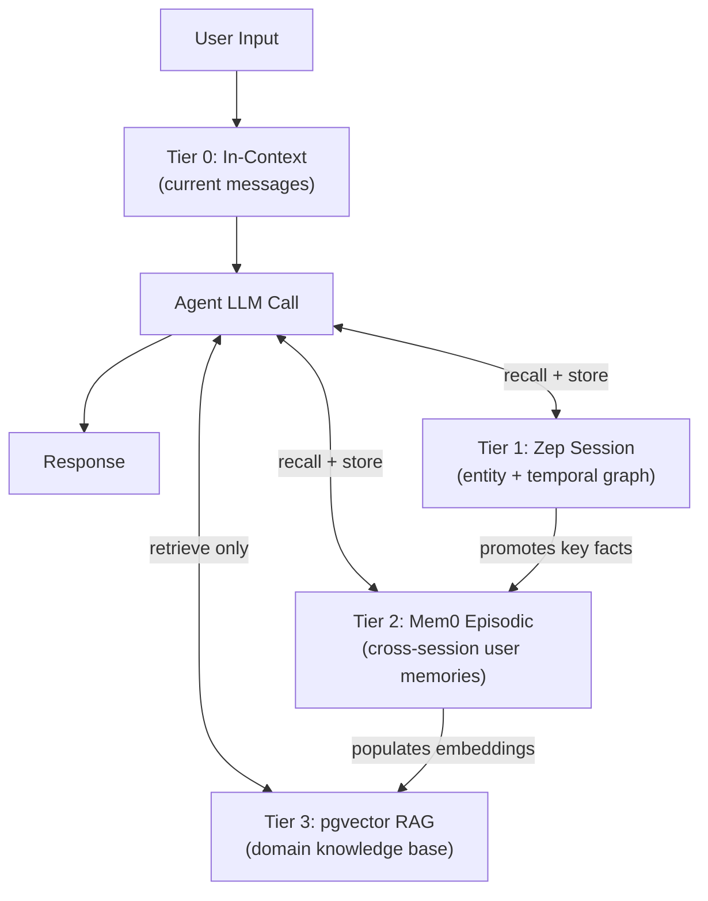

# Agentic Memory Architect & Episodic Memory Guide

[English](#english) | [Bahasa Indonesia](#bahasa-indonesia)

---

<a name="english"></a>
## English

### Orchestration & Integration

Connects and orchestrates with:
- `multi-agent-orchestration` — shared memory state across agent swarms
- `pydantic-ai-expert` — type-safe memory injection into Pydantic AI agents
- `session-memory-manager` — short-term session checkpoint layer
- `vector-db-rag-expert` — pgvector/HNSW for long-term episodic retrieval
- `database-orm-expert` — Prisma/Drizzle schema for memory persistence
- `ai-llm-integration-expert` — context window injection at inference time
- `zero-to-prod-orchestrator` — memory layer provisioned in Phase 2 (Foundation)

---

### Purpose

Design and implement persistent, multi-tier memory systems for autonomous AI agents that transcend simple context windows. Enable agents to **remember users across sessions**, recall past decisions, maintain knowledge graphs, and operate with human-like episodic continuity — all while remaining within token budget constraints.

---

### Memory Tier Architecture

```
┌─────────────────────────────────────────────────────────────────┐
│                    AGENT MEMORY HIERARCHY                        │
├─────────────────────────────────────────────────────────────────┤
│  TIER 0 │ In-Context Working Memory (current conversation)       │
│         │ ≤ 128K tokens │ Lost on session end                   │
│         │ Implementation: Raw messages array in LLM call         │
├─────────────────────────────────────────────────────────────────┤
│  TIER 1 │ Session Memory (within-session graph)                  │
│         │ Hours to days │ Redis / Zep session store              │
│         │ Implementation: Zep v2 session + entity graph          │
├─────────────────────────────────────────────────────────────────┤
│  TIER 2 │ Episodic Memory (cross-session, user-scoped)           │
│         │ Weeks to months │ Mem0 + pgvector HNSW                 │
│         │ Implementation: Mem0 Memory.add() / Memory.search()    │
├─────────────────────────────────────────────────────────────────┤
│  TIER 3 │ Semantic / Procedural Memory (agent knowledge base)    │
│         │ Permanent │ pgvector + structured KB tables            │
│         │ Implementation: RAG pipeline over domain knowledge     │
└─────────────────────────────────────────────────────────────────┘
```



---

### 1. Mem0 v2 — Cross-Session Episodic Memory

Mem0 provides a managed memory layer that extracts and stores entities, preferences, and facts from conversations, making them searchable across sessions.

```bash
pip install mem0ai
# OR for self-hosted:
pip install mem0ai[oss]
```

#### Python: Full CRUD Memory Operations

```python
import os
from mem0 import Memory

# Initialize with custom vector store (pgvector)
config = {
    "vector_store": {
        "provider": "pgvector",
        "config": {
            "dbname": "mem0_db",
            "collection_name": "agent_memories",
            "embedding_model_dims": 1536,
            "host": os.environ["PGVECTOR_HOST"],
            "port": 5432,
            "user": os.environ["PGVECTOR_USER"],
            "password": os.environ["PGVECTOR_PASSWORD"],
        },
    },
    "llm": {
        "provider": "anthropic",
        "config": {
            "model": "claude-sonnet-4-5",
            "api_key": os.environ["ANTHROPIC_API_KEY"],
        },
    },
    "embedder": {
        "provider": "openai",
        "config": {
            "model": "text-embedding-3-small",
            "api_key": os.environ["OPENAI_API_KEY"],
        },
    },
}

memory = Memory.from_config(config)

# ADD: Store memories from a conversation turn
def add_conversation_memory(user_id: str, messages: list[dict]) -> list[dict]:
    """
    Extract and store memories from a conversation.
    Mem0 automatically identifies entities, preferences, and facts.
    Returns list of memory entries created.
    """
    result = memory.add(
        messages=messages,
        user_id=user_id,
        metadata={"source": "conversation", "app": "my-agent"},
    )
    return result  # [{"id": "uuid", "memory": "User prefers TypeScript over Python", ...}]


# SEARCH: Retrieve relevant memories for the current query
def recall_memories(user_id: str, query: str, top_k: int = 5) -> list[dict]:
    """
    Vector-similarity search over user's episodic memories.
    Returns ranked list of relevant memories.
    """
    results = memory.search(
        query=query,
        user_id=user_id,
        limit=top_k,
    )
    return results  # [{"id": "...", "memory": "...", "score": 0.92, ...}]


# GET ALL: List all memories for a user
def get_all_memories(user_id: str) -> list[dict]:
    return memory.get_all(user_id=user_id)


# UPDATE: Correct or expand an existing memory
def update_memory(memory_id: str, new_data: str) -> dict:
    return memory.update(memory_id=memory_id, data=new_data)


# DELETE: Remove a specific memory
def delete_memory(memory_id: str) -> None:
    memory.delete(memory_id=memory_id)


# RESET: Clear all memories for a user (use with caution)
def reset_user_memories(user_id: str) -> None:
    memory.delete_all(user_id=user_id)


# --- AGENT LOOP INTEGRATION ---
async def agent_with_memory(user_id: str, user_input: str) -> str:
    import anthropic

    # 1. Recall relevant past memories
    memories = recall_memories(user_id, user_input, top_k=5)
    memory_context = "\n".join(
        f"- {m['memory']}" for m in memories if m.get("score", 0) > 0.7
    )

    system_prompt = f"""You are a helpful AI assistant.
You have the following relevant memories about this user:
{memory_context if memory_context else "No prior memories found."}
Use these memories to personalize your response."""

    client = anthropic.Anthropic()
    response = client.messages.create(
        model="claude-sonnet-4-5",
        max_tokens=2048,
        system=system_prompt,
        messages=[{"role": "user", "content": user_input}],
    )
    assistant_reply = response.content[0].text

    # 2. Store this turn in Mem0 for future sessions
    add_conversation_memory(
        user_id,
        [
            {"role": "user", "content": user_input},
            {"role": "assistant", "content": assistant_reply},
        ],
    )

    return assistant_reply
```

#### TypeScript: Mem0 Client

```typescript
import MemoryClient from "mem0ai";

const mem0 = new MemoryClient({ apiKey: process.env.MEM0_API_KEY! });

export interface Memory {
  id: string;
  memory: string;
  score?: number;
  created_at: string;
  updated_at: string;
}

export async function addMemory(
  userId: string,
  messages: Array<{ role: "user" | "assistant"; content: string }>,
): Promise<Memory[]> {
  const result = await mem0.add(messages, { user_id: userId });
  return result as Memory[];
}

export async function searchMemory(
  userId: string,
  query: string,
  limit = 5,
): Promise<Memory[]> {
  const results = await mem0.search(query, { user_id: userId, limit });
  return results as Memory[];
}

export async function deleteMemory(memoryId: string): Promise<void> {
  await mem0.delete(memoryId);
}

export async function getAllMemories(userId: string): Promise<Memory[]> {
  const result = await mem0.getAll({ user_id: userId });
  return result as Memory[];
}
```

---

### 2. Letta (MemGPT) — Unbounded In-Context Memory Management

Letta enables LLMs to manage their own memory by providing explicit memory blocks (`core_memory`, `archival_memory`) that the model can read/write through tool calls, effectively giving LLMs unlimited memory.

```bash
pip install letta-client
letta server start  # starts local Letta server on :8283
```

#### Python: Persisted Agent with Custom Memory

```python
from letta_client import Letta

client = Letta(base_url="http://localhost:8283")

# Create a persisted agent with custom memory blocks
agent = client.agents.create(
    name="research-assistant",
    model="anthropic/claude-sonnet-4-5",
    embedding="openai/text-embedding-3-small",
    memory_blocks=[
        {
            "label": "human",
            "value": "Name: Unknown\nPreferences: Unknown\nProjects: None yet.",
            "limit": 2000,
        },
        {
            "label": "persona",
            "value": (
                "I am a research assistant with persistent memory. "
                "I remember user preferences, past discussions, and project context "
                "across all sessions."
            ),
            "limit": 2000,
        },
    ],
    tools=["core_memory_append", "core_memory_replace", "archival_memory_insert",
           "archival_memory_search"],
)

print(f"Agent ID: {agent.id}")  # Save this for future sessions


def chat_with_persisted_agent(agent_id: str, message: str) -> str:
    """Send a message to a persisted Letta agent and get a response."""
    resp = client.agents.messages.create(
        agent_id=agent_id,
        messages=[{"role": "user", "content": message}],
    )
    # Extract the assistant text from the response
    for msg in resp.messages:
        if msg.message_type == "assistant_message":
            return msg.content
    return ""


def get_agent_memory(agent_id: str) -> dict:
    """Inspect current in-context memory blocks of the agent."""
    memory = client.agents.core_memory.retrieve(agent_id=agent_id)
    return {block.label: block.value for block in memory.memory.values()}


def search_archival_memory(agent_id: str, query: str) -> list[str]:
    """Search the agent's long-term archival memory store."""
    results = client.agents.archival_memory.list(agent_id=agent_id, query=query)
    return [r.text for r in results.archival_memory]
```

---

### 3. Zep v2 — Temporal Memory & User Knowledge Graph

Zep provides a fast memory service with temporal awareness, entity extraction, and user knowledge graph construction. It handles the Tier 1 (session) and bridges to Tier 2 (episodic).

```bash
pip install zep-cloud
# OR self-hosted:
docker run -p 8000:8000 ghcr.io/getzep/zep:latest
```

#### Python: Zep Session + Graph Memory

```python
import os
from zep_cloud.client import AsyncZep
from zep_cloud.types import Message, RoleType

zep = AsyncZep(api_key=os.environ["ZEP_API_KEY"])


async def ensure_user_and_session(user_id: str, session_id: str) -> None:
    """Idempotently create user and session in Zep."""
    try:
        await zep.user.add(user_id=user_id)
    except Exception:
        pass  # User already exists

    try:
        await zep.memory.add_session(
            session_id=session_id,
            user_id=user_id,
            metadata={"app": "my-agent", "version": "1.0"},
        )
    except Exception:
        pass  # Session already exists


async def store_turn(
    session_id: str,
    user_message: str,
    assistant_message: str,
) -> None:
    """Persist a conversation turn to Zep for memory extraction."""
    await zep.memory.add(
        session_id=session_id,
        messages=[
            Message(role_type=RoleType.UserRole, role="user", content=user_message),
            Message(role_type=RoleType.AssistantRole, role="assistant", content=assistant_message),
        ],
    )


async def recall_session_context(session_id: str) -> str:
    """Retrieve Zep's synthesized memory summary + relevant facts."""
    memory = await zep.memory.get(session_id=session_id)
    parts = []
    if memory.summary and memory.summary.content:
        parts.append(f"Session Summary:\n{memory.summary.content}")
    if memory.facts:
        facts_text = "\n".join(f"- {fact}" for fact in memory.facts[:10])
        parts.append(f"Key Facts:\n{facts_text}")
    return "\n\n".join(parts)


async def search_user_graph(user_id: str, query: str) -> list[dict]:
    """
    Search the user's temporal knowledge graph for entities and relations.
    Returns enriched context about what Zep knows about this user.
    """
    results = await zep.graph.search(
        user_id=user_id,
        query=query,
        scope="edges",       # 'nodes' | 'edges' — edges capture relations
        limit=10,
        reranker="rrf",      # Reciprocal Rank Fusion for hybrid search
    )
    return [
        {
            "source": edge.source_node_name,
            "relation": edge.relation,
            "target": edge.target_node_name,
            "fact": edge.fact,
            "created_at": edge.created_at.isoformat() if edge.created_at else None,
        }
        for edge in (results.edges or [])
    ]


async def add_structured_data_to_graph(user_id: str, data: str, data_type: str = "text") -> None:
    """
    Inject structured information (e.g., user profile JSON) into Zep's graph.
    Zep will extract entities and relations automatically.
    """
    await zep.graph.add(user_id=user_id, data=data, type=data_type)
```

---

### 4. pgvector + HNSW — Long-Term Episodic Storage

For Tier 2/3 storage, use PostgreSQL with pgvector and HNSW indexes for sub-millisecond similarity search over millions of memory embeddings.

#### SQL Schema

```sql
-- Enable pgvector extension
CREATE EXTENSION IF NOT EXISTS vector;

-- Episodic memory table
CREATE TABLE agent_memories (
    id           UUID PRIMARY KEY DEFAULT gen_random_uuid(),
    user_id      TEXT NOT NULL,
    agent_id     TEXT,
    content      TEXT NOT NULL,
    embedding    VECTOR(1536) NOT NULL,  -- OpenAI text-embedding-3-small
    tier         SMALLINT NOT NULL DEFAULT 2,  -- 1=session, 2=episodic, 3=semantic
    source       TEXT NOT NULL DEFAULT 'conversation',
    metadata     JSONB NOT NULL DEFAULT '{}',
    created_at   TIMESTAMPTZ NOT NULL DEFAULT NOW(),
    expires_at   TIMESTAMPTZ              -- NULL = permanent
);

-- HNSW index for cosine similarity (outperforms IVFFlat at recall@10)
CREATE INDEX idx_memories_embedding_hnsw ON agent_memories
USING hnsw (embedding vector_cosine_ops)
WITH (m = 16, ef_construction = 64);

-- B-tree for user-scoped filtering
CREATE INDEX idx_memories_user_id ON agent_memories (user_id);

-- Composite for time-scoped recall
CREATE INDEX idx_memories_user_created ON agent_memories (user_id, created_at DESC);
```

#### TypeScript: pgvector Memory Repository

```typescript
import { Pool } from "pg";
import OpenAI from "openai";

const pool = new Pool({ connectionString: process.env.DATABASE_URL });
const openai = new OpenAI({ apiKey: process.env.OPENAI_API_KEY });

export interface EpisodicMemory {
  id: string;
  userId: string;
  content: string;
  metadata: Record<string, unknown>;
  createdAt: Date;
  similarity?: number;
}

async function embed(text: string): Promise<number[]> {
  const resp = await openai.embeddings.create({
    model: "text-embedding-3-small",
    input: text,
  });
  return resp.data[0].embedding;
}

export async function storeMemory(
  userId: string,
  content: string,
  metadata: Record<string, unknown> = {},
  tier: 1 | 2 | 3 = 2,
): Promise<string> {
  const embedding = await embed(content);
  const vectorLiteral = `[${embedding.join(",")}]`;

  const result = await pool.query<{ id: string }>(
    `INSERT INTO agent_memories (user_id, content, embedding, tier, metadata)
     VALUES ($1, $2, $3::vector, $4, $5)
     RETURNING id`,
    [userId, content, vectorLiteral, tier, JSON.stringify(metadata)],
  );

  return result.rows[0].id;
}

export async function recallMemories(
  userId: string,
  query: string,
  topK = 5,
  minSimilarity = 0.70,
): Promise<EpisodicMemory[]> {
  const embedding = await embed(query);
  const vectorLiteral = `[${embedding.join(",")}]`;

  const result = await pool.query<EpisodicMemory & { similarity: number }>(
    `SELECT
       id,
       user_id AS "userId",
       content,
       metadata,
       created_at AS "createdAt",
       1 - (embedding <=> $1::vector) AS similarity
     FROM agent_memories
     WHERE user_id = $2
       AND (expires_at IS NULL OR expires_at > NOW())
       AND 1 - (embedding <=> $1::vector) >= $3
     ORDER BY embedding <=> $1::vector
     LIMIT $4`,
    [vectorLiteral, userId, minSimilarity, topK],
  );

  return result.rows;
}

export async function deleteExpiredMemories(): Promise<number> {
  const result = await pool.query(
    `DELETE FROM agent_memories WHERE expires_at IS NOT NULL AND expires_at <= NOW()`,
  );
  return result.rowCount ?? 0;
}
```

---

### 5. Memory Injection Template — RAG Pipeline Integration

```typescript
import { recallMemories } from "./memory-repository";
import { searchMemory } from "./mem0-client";

export async function buildMemoryAugmentedPrompt(
  userId: string,
  userInput: string,
  systemBase: string,
): Promise<{ system: string; injectedMemoryCount: number }> {
  // Parallel recall from Tier 2 (pgvector) and Mem0
  const [pgMemories, mem0Memories] = await Promise.all([
    recallMemories(userId, userInput, 5, 0.72),
    searchMemory(userId, userInput, 5),
  ]);

  const allMemories = [
    ...pgMemories.map((m) => ({ content: m.content, score: m.similarity ?? 0, source: "episodic" })),
    ...mem0Memories
      .filter((m) => (m.score ?? 0) > 0.7)
      .map((m) => ({ content: m.memory, score: m.score ?? 0, source: "mem0" })),
  ]
    .sort((a, b) => b.score - a.score)
    .slice(0, 8);                         // Top 8 memories across both sources

  const memoryBlock =
    allMemories.length > 0
      ? `\n\n## Relevant Memories About This User\n${allMemories
          .map((m) => `- [${m.source}] ${m.content}`)
          .join("\n")}`
      : "";

  return {
    system: `${systemBase}${memoryBlock}`,
    injectedMemoryCount: allMemories.length,
  };
}
```

---

### 6. Memory CRUD — Full TypeScript Interface

```typescript
// memory-manager.ts — unified interface over Mem0 + pgvector
import { addMemory, searchMemory, getAllMemories, deleteMemory } from "./mem0-client";
import { storeMemory, recallMemories } from "./memory-repository";

export type MemoryBackend = "mem0" | "pgvector" | "both";

export async function createMemory(
  userId: string,
  content: string,
  backend: MemoryBackend = "both",
  metadata: Record<string, unknown> = {},
): Promise<{ mem0Ids?: string[]; pgvectorId?: string }> {
  const results: { mem0Ids?: string[]; pgvectorId?: string } = {};

  if (backend === "mem0" || backend === "both") {
    const mem0Result = await addMemory(userId, [
      { role: "user", content: `Remember this: ${content}` },
    ]);
    results.mem0Ids = mem0Result.map((m) => m.id);
  }

  if (backend === "pgvector" || backend === "both") {
    results.pgvectorId = await storeMemory(userId, content, metadata);
  }

  return results;
}

export async function queryMemory(
  userId: string,
  query: string,
  backend: MemoryBackend = "both",
): Promise<Array<{ content: string; score: number; source: string }>> {
  const results: Array<{ content: string; score: number; source: string }> = [];

  if (backend === "mem0" || backend === "both") {
    const mem0Results = await searchMemory(userId, query, 5);
    results.push(
      ...mem0Results.map((m) => ({
        content: m.memory,
        score: m.score ?? 0.5,
        source: "mem0",
      })),
    );
  }

  if (backend === "pgvector" || backend === "both") {
    const pgResults = await recallMemories(userId, query, 5);
    results.push(
      ...pgResults.map((m) => ({
        content: m.content,
        score: m.similarity ?? 0.5,
        source: "pgvector",
      })),
    );
  }

  return results.sort((a, b) => b.score - a.score).slice(0, 10);
}

export async function purgeUserMemory(
  userId: string,
  backend: MemoryBackend = "both",
): Promise<void> {
  const { Pool } = await import("pg");
  const pool = new Pool({ connectionString: process.env.DATABASE_URL });

  const tasks: Promise<void>[] = [];

  if (backend === "mem0" || backend === "both") {
    const { default: MemoryClient } = await import("mem0ai");
    const mem0 = new MemoryClient({ apiKey: process.env.MEM0_API_KEY! });
    tasks.push(mem0.deleteAll({ user_id: userId }).then(() => undefined));
  }

  if (backend === "pgvector" || backend === "both") {
    tasks.push(
      pool
        .query("DELETE FROM agent_memories WHERE user_id = $1", [userId])
        .then(() => undefined),
    );
  }

  await Promise.all(tasks);
}
```

---

<a name="bahasa-indonesia"></a>
## Bahasa Indonesia

### Integrasi Orkestrasi

Terhubung dan mengorkestrasi bersama:
- `multi-agent-orchestration` — state memori bersama di seluruh agent swarm
- `pydantic-ai-expert` — injeksi memori type-safe ke agen Pydantic AI
- `session-memory-manager` — lapisan checkpoint sesi jangka pendek
- `vector-db-rag-expert` — pgvector/HNSW untuk retrieval episodik jangka panjang
- `database-orm-expert` — skema Prisma/Drizzle untuk persistensi memori
- `ai-llm-integration-expert` — injeksi context window saat inferensi
- `zero-to-prod-orchestrator` — lapisan memori diprovisioning di Phase 2 (Foundation)

---

### Tujuan

Merancang dan mengimplementasikan sistem memori multi-tier yang persisten untuk agen AI otonom yang melampaui context window sederhana. Memungkinkan agen untuk **mengingat pengguna lintas sesi**, memanggil keputusan masa lalu, mempertahankan knowledge graph, dan beroperasi dengan kontinuitas episodik menyerupai manusia — sambil tetap dalam batas anggaran token.

---

### Arsitektur Tier Memori

| Tier | Nama | Durasi | Teknologi | Kapasitas |
|------|------|---------|-----------|-----------|
| 0 | In-Context Working Memory | Sesi saat ini | Array messages LLM | ≤ 128K token |
| 1 | Session Memory | Jam hingga hari | Zep v2 session + entity graph | Tak terbatas (ringkasan) |
| 2 | Episodic Memory | Minggu hingga bulan | Mem0 + pgvector HNSW | Jutaan memori |
| 3 | Semantic / Procedural | Permanen | pgvector RAG + tabel KB terstruktur | Basis pengetahuan domain |

---

### 1. Mem0 v2 — Memori Episodik Lintas Sesi

Mem0 menyediakan lapisan memori terkelola yang mengekstrak dan menyimpan entitas, preferensi, dan fakta dari percakapan, sehingga dapat dicari lintas sesi.

**Konsep kunci:**
- `Memory.add(messages, user_id)`: ekstrak dan simpan memori dari percakapan — Mem0 secara otomatis mengidentifikasi entitas (nama, preferensi, kendala proyek)
- `Memory.search(query, user_id, limit)`: pencarian vektor-kemiripan atas memori episodik pengguna — kembalikan daftar berperingkat fakta yang relevan
- **Multi-user isolation**: setiap memori terikat pada `user_id` — tidak ada kebocoran antar pengguna
- **Entity extraction**: Mem0 menggunakan LLM untuk mengekstrak entitas terstruktur (nama, preferensi, batasan) dari percakapan mentah

**Dukungan backend:** Mem0 Cloud (API), atau self-hosted dengan pgvector, Qdrant, Pinecone, atau Chroma.

Lihat implementasi lengkap Python dan TypeScript di [seksi English](#english).

---

### 2. Letta/MemGPT — Manajemen Memori In-Context Tak Terbatas

Letta memungkinkan LLM mengelola memori sendiri melalui tool calls eksplisit ke blok memori:
- **`core_memory_append`**: tambahkan fakta baru ke blok memori inti (persona, human profile)
- **`core_memory_replace`**: perbarui fakta yang sudah ada di memori inti
- **`archival_memory_insert`**: simpan informasi ke penyimpanan arsip jangka panjang (vektor)
- **`archival_memory_search`**: cari arsip menggunakan pencarian semantik

**Pola penggunaan:**
1. Buat agen persisten dengan `client.agents.create()` — simpan `agent_id`
2. Gunakan `agent_id` yang sama di semua sesi masa depan — agen ingat konteks sebelumnya
3. Agen secara proaktif mengelola memorinya sendiri melalui tool calls saat konteks penuh

---

### 3. Zep v2 — Memori Temporal & Knowledge Graph Pengguna

Zep menyediakan layanan memori cepat dengan kesadaran temporal, ekstraksi entitas, dan konstruksi knowledge graph pengguna.

**Fitur utama:**
- **Temporal memory**: setiap fakta dicap waktu — agen dapat mempertanyakan "apa yang pengguna katakan minggu lalu tentang X?"
- **Entity graph**: Zep secara otomatis membangun graf pengetahuan entitas dari percakapan (orang, tempat, preferensi, keputusan)
- **`graph.add()`**: injeksikan data terstruktur (JSON profil pengguna) ke grafik — Zep mengekstrak entitas dan relasi
- **`graph.search(scope="edges")`**: cari relasi di knowledge graph menggunakan hybrid search (vektor + kata kunci) + RRF reranking
- **Session summary**: Zep secara otomatis merangkum sesi panjang menjadi ringkasan yang dapat diinjeksikan ke konteks agen

---

### 4. pgvector + HNSW — Penyimpanan Episodik Jangka Panjang

Untuk penyimpanan Tier 2/3, gunakan PostgreSQL dengan pgvector dan indeks HNSW untuk pencarian kemiripan sub-milidetik atas jutaan embedding memori.

**Mengapa HNSW daripada IVFFlat?**
- HNSW: recall@10 = 99%+, latensi stabil tanpa perlu `VACUUM`
- IVFFlat: recall@10 = 95%, memerlukan pemilihan `nlist` yang tepat dan `VACUUM` rutin

**Parameter HNSW yang direkomendasikan:**
- `m = 16`: koneksi per lapisan — keseimbangan antara performa recall dan penggunaan memori
- `ef_construction = 64`: kualitas indeks saat build — nilai lebih tinggi = recall lebih baik, build lebih lambat
- `ef_search = 40` (opsional via `SET hnsw.ef_search = 40`): kualitas pencarian saat query

---

### 5. Template Injeksi Memori ke RAG Pipeline

**Alur retrieval memori optimal:**

```
Query pengguna
    ↓
[Parallel Recall]
    ├── pgvector HNSW search (Tier 2 episodic)
    └── Mem0 semantic search (cross-session)
    ↓
[Merge & Rerank by similarity score]
    ↓
[Filter: min_similarity = 0.70, top_k = 8]
    ↓
[Inject ke system prompt sebagai "Relevant Memories" block]
    ↓
LLM call → response
    ↓
[Store turn to Mem0 + pgvector async]
```

---

### Anti-Slop Checklist Memori

- [ ] `user_id` selalu unik dan konsisten antar sesi — gunakan UUID deterministik (mis. `uuid5(NAMESPACE_DNS, email)`)
- [ ] Minimal similarity threshold 0.70 untuk menghindari injeksi memori tidak relevan
- [ ] Memori yang disimpan tidak melebihi `expires_at` — implementasikan TTL untuk memori sementara
- [ ] Zep session dibuat sebelum `memory.add()` dipanggil — validasi idempoten
- [ ] Letta `agent_id` disimpan di database untuk reuse lintas sesi
- [ ] Purge memori pengguna tersedia untuk kepatuhan GDPR/PDPA
- [ ] Semua operasi memori async — tidak memblokir response agen
- [ ] Indeks HNSW di-`REINDEX` setelah lebih dari 10% baris dihapus
