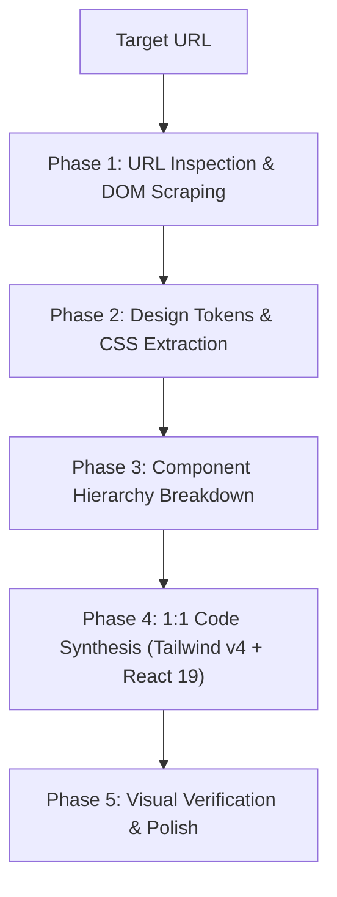

# Website Design Cloner & Reverse Engineering Expert (2026 Edition)

[English](#english) | [Bahasa Indonesia](#bahasa-indonesia)

---

<a name="english"></a>
## English

### Orchestration & Integration
Connects and orchestrates with relevant domain skills like `brainstorming`, `zero-to-prod-orchestrator`, and `session-memory-manager` to ensure cohesive execution.

### Description
`website-design-cloner` is an advanced URL-to-Code visual reverse engineering skill. It enables AI agents to inspect any target website URL, analyze its visual aesthetic, layout grid, CSS design tokens (OKLCH/HEX colors, typography system, container bounds, shadow tiers, border-radii), DOM structure, and interactive components, and synthesize production-ready code (Tailwind CSS v4, React 19, Next.js 15, HTML5/Vanilla CSS) to achieve a full 1:1 duplication.

### Trigger Conditions
- Replicating or cloning a website layout, landing page, or web application directly from a target URL.
- Extracting design systems (color palettes, typography scales, container grids, component patterns) from a reference link.
- Re-creating complex UI components (Hero banners, Bento grids, navbar drawers, pricing tables, footers) based on live URLs.
- Auditing and reverse-engineering third-party website layouts for component scaffolding.

---

### 5-Step URL-to-Code Reverse Engineering Methodology



#### Phase 1: URL Inspection & Asset Discovery
1. **Content Fetching**: Retrieve raw DOM, inline CSS, stylesheet links (`<link rel="stylesheet">`), and font imports using `read_url_content`, Firecrawl, Jina Reader API (`https://r.jina.ai/<URL>`), or Playwright browser automation.
2. **Visual Viewport Inspection**: Capture layout snapshots across break-points:
   - Mobile (`375px`)
   - Tablet (`768px`)
   - Desktop (`1440px+`)
3. **Asset Mining**: Extract SVG icons (Lucide/Heroicons equivalents), image asset URLs, logo vectors, and background gradients.

#### Phase 2: Design Tokens & CSS Harvester
Harvest computed styles and synthesize them into Tailwind CSS v4 `@theme` tokens:

| Token Category | Extracted Properties | Tailwind CSS v4 Mapping |
|---|---|---|
| **Color System** | Primary, Secondary, Background, Neutral slate, Surface, Borders | `--color-primary`, `--color-background`, `--color-surface` |
| **Typography** | Font Family (Google Fonts link), Headings (`h1`-`h6`), Body, Font Weights | `--font-sans`, `--font-mono`, `--text-4xl`, `--font-bold` |
| **Spacing Scale** | Section Padding (`py-16`/`py-24`), Container Max-Width (`1280px`), Gap scale | `--spacing-16`, `--max-width-7xl`, `gap-6` |
| **Borders & Radii** | Card Border Radius (`16px`), Pill Radius (`9999px`), Border Colors | `--radius-xl`, `--color-border` |
| **Effects** | Backdrop Blur (`backdrop-blur-md`), Glassmorphism, Drop Shadows | `shadow-xl shadow-brand/10`, `backdrop-blur-lg` |

#### Phase 3: Component Hierarchy Breakdown
Deconstruct the target web page into modular, reusable UI components:
- **`HeaderNav`**: Brand logo, navigation menu links, dynamic CTA button, mobile drawer toggle.
- **`HeroSection`**: Eye-catching headline, subheading, action buttons, hero image/video/mockup.
- **`FeatureBento`**: Bento grid containers, icon badges, feature titles, micro-copy.
- **`TestimonialGrid`**: Avatar image, quote text, author metadata, star ratings.
- **`PricingSection`**: Tier cards, billing toggle (Monthly/Annual), highlighted popular badge, feature checklists.
- **`FooterNav`**: Category columns, newsletter subscription form, copyright & social icons.

#### Phase 4: 1:1 Code Synthesis (Tailwind v4 + React 19)
Synthesize clean, accessible, modern code matching the extracted structure.

##### Example: Extracted Tailwind CSS v4 Theme (`tokens.css`)
```css
@import "tailwindcss";

@theme {
  --font-sans: "Outfit", "Inter", system-ui, sans-serif;
  --font-mono: "Fira Code", monospace;

  /* Extracted OKLCH Palette */
  --color-brand-primary: oklch(58% 0.23 255);
  --color-brand-accent:  oklch(68% 0.19 160);
  --color-surface-dark:  oklch(14% 0.02 255);
  --color-surface-card:  oklch(18% 0.03 255 / 80%);

  --radius-card: 1.25rem;
}
```

##### Example: Recreated Hero Component (`HeroSection.tsx`)
```tsx
import React from 'react';
import { ArrowRight } from 'lucide-react';

export function HeroSection() {
  return (
    <section className="relative bg-neutral-50 dark:bg-neutral-950 py-20 md:py-28 px-6">
      <div className="mx-auto max-w-4xl text-center">
        {/* Eyebrow: Crisp typographic landmark with optical tracking */}
        <span className="inline-flex items-center rounded-md border border-neutral-200 dark:border-neutral-800 bg-white dark:bg-neutral-900 px-3 py-1 text-[11px] font-semibold uppercase tracking-wider text-neutral-600 dark:text-neutral-400 shadow-xs">
          Architecture Verified
        </span>
        
        {/* Title: Punchy authority with tight tracking */}
        <h1 className="mt-6 text-4xl sm:text-5xl lg:text-6xl font-bold tracking-tight text-neutral-900 dark:text-neutral-50 leading-[1.1]">
          Precision Web Engineering with Sovereign Aesthetics
        </h1>
        
        {/* Subtitle: High-readability body copy */}
        <p className="mx-auto mt-6 max-w-2xl text-base sm:text-lg text-neutral-600 dark:text-neutral-300 leading-relaxed">
          Cleanly engineered, fully accessible UI components extracted with precision tokens and robust visual hierarchy.
        </p>
        
        {/* Actions: Single primary CTA dominance + subtle ghost action */}
        <div className="mt-10 flex items-center justify-center gap-4">
          <button
            type="button"
            className="cursor-pointer inline-flex items-center gap-2 rounded-lg bg-neutral-900 dark:bg-neutral-100 px-6 py-3 text-sm font-medium text-white dark:text-neutral-900 shadow-xs transition hover:bg-neutral-800 dark:hover:bg-white active:scale-[0.98] focus-visible:ring-2 focus-visible:ring-neutral-900 focus-visible:ring-offset-2"
          >
            Explore System
            <ArrowRight className="h-4 w-4" />
          </button>
          <button
            type="button"
            className="cursor-pointer rounded-lg border border-neutral-200 dark:border-neutral-800 bg-white dark:bg-neutral-900 px-6 py-3 text-sm font-medium text-neutral-700 dark:text-neutral-300 transition hover:bg-neutral-100 dark:hover:bg-neutral-800 active:scale-[0.98] focus-visible:ring-2 focus-visible:ring-neutral-400"
          >
            Documentation
          </button>
        </div>
      </div>
    </section>
  );
}
```

##### Material Design 3 (M3) Pattern Recognition (https://m3.material.io/)
When cloning target sites utilizing Material Design 3 (Google products, Flutter web apps, Android dashboards):
- **Detect M3 Surface Containers**: Identify background layering using tonal container levels (`surface-container-low` to `highest`) rather than drop shadows.
- **Identify M3 Primitives**: Map Floating Action Buttons (FAB), Navigation Rails (tablet/desktop), Navigation Bars (mobile), and Tonal/Filled/Outlined buttons directly to canonical M3 component tokens.
- **Extract Dynamic Colors**: Group related primary/container and secondary/container pairs into semantic M3 color roles.

#### Phase 5: Visual Verification & Polish
- Ensure color contrast passes WCAG 2.2 AAA standard (4.5:1 ratio).
- Validate full responsiveness on mobile viewports.
- Replace broken image assets with synthesized visual placeholders using `generate_image`.

---

<a name="bahasa-indonesia"></a>
## Bahasa Indonesia

### Integrasi Orkestrasi
Terhubung dan mengorkestrasi skill domain yang relevan seperti `brainstorming`, `zero-to-prod-orchestrator`, dan `session-memory-manager` untuk memastikan eksekusi yang kohesif.

### Deskripsi
`website-design-cloner` adalah skill rekayasa balik (*reverse engineering*) visual dari URL ke kode. Skill ini memungkinkan agen AI mempelajari situs web target dari URL, mengaudit estetika visual, grid layout, design token CSS (warna OKLCH/HEX, sistem tipografi, batas kontainer, bayangan, radius border), struktur DOM, dan komponen interaktif, lalu merekonstruksi kode siap produksi (Tailwind CSS v4, React 19, Next.js 15, HTML5/CSS3) untuk mencapai duplikasi 1:1 penuh.

### Kondisi Pemicu
- Merekapitulasi atau menduplikasi tata letak situs web, landing page, atau aplikasi web dari URL target.
- Mengekstrak design system (skema warna, skala tipografi, grid kontainer, pola komponen) dari tautan referensi.
- Membangun kembali komponen UI kompleks (banner Hero, Bento grid, drawer navigasi, tabel harga, footer) berdasarkan URL langsung.
- Mempelajari struktur visual dan rekayasa balik situs web pihak ketiga untuk template baru.

---

### Metodologi 5-Langkah Duplikasi URL-ke-Kode

1. **Tahap 1: Inspeksi URL & Penemuan Aset**:
   - Mengambil HTML mentah, inline CSS, tautan stylesheet, dan font melalui `read_url_content`, Firecrawl, Jina Reader API (`https://r.jina.ai/<URL>`), atau otomatisasi browser Playwright.
   - Mengambil snapshot tampilan visual pada breakpoint Mobile (`375px`), Tablet (`768px`), dan Desktop (`1440px`).
   - Ekstraksi ikon SVG, URL gambar, logo, dan gradien latar belakang.

2. **Tahap 2: Ekstraksi Design Token & Hierarki Visual**:
   - Mengekstrak properti CSS computed dan menyintesisnya ke dalam token `@theme` Tailwind CSS v4 (sistem warna OKLCH/HEX, tipografi Google Fonts, skala spacing, border radius, dan hierarki permukaan L0-L4).
   - Memetakan rasio kontras 60-30-10, optical letter-spacing (`tracking-tight` pada judul, `tracking-wider` pada eyebrow), serta memastikan angka memakai format `tabular-nums`.

3. **Tahap 3: Pembongkaran Hierarki Komponen**:
   - Membagi halaman web target menjadi komponen modular: `HeaderNav`, `HeroSection`, `FeatureBento`, `TestimonialGrid`, `PricingSection`, dan `FooterNav`.

4. **Tahap 4: Sintesis Kode Presisi 1:1**:
   - Menyusun kode bersih dan modular dalam React 19 / Next.js 15 / HTML+CSS modern yang menggunakan token `@theme` Tailwind CSS v4.

5. **Tahap 5: Verifikasi Visual & Polishing**:
   - Memastikan rasio kontras WCAG 2.2, tes responsivitas mobile, dan membuat aset gambar pengganti presisi dengan tool `generate_image`.

---

### Matriks Orkestrasi & Handoff Skill

| Skill Terkait | Peran & Integrasi Handoff |
|---|---|
| `web-scraper` | Mengambil HTML mentah, CSS, dan Markdown dari URL via Jina Reader / Firecrawl API. |
| `design-system-architect` | Menyusun token visual hasil ekstraksi ke dalam design system enterprise berbasis OKLCH & Radix/Base UI. |
| `ui-ux-pro-max` | Memberikan acuan BM25 visual style, pasangan font Google Fonts, dan checklist aksesibilitas WCAG 2.2. |
| `senior-frontend` | Mengimplementasikan kode komponen React 19 / Next.js 15 App Router siap produksi. |
| `tailwind-expert` | Mengatur konfigurasi Tailwind CSS v4 `@theme` dan utilitas responsif. |